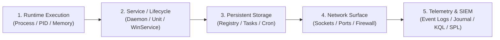

Vision & Technical Philosophy

# Executive Summary

<strong>A technical knowledge base engineered to match how practitioners actually think, troubleshoot, and connect operational systems.</strong>

---

## The Vision: Knowledge Built for the Human Operator

Every systems administrator, security analyst, and incident responder shares a common frustration: **traditional knowledge bases fail the moment an actual incident occurs.**

Traditional enterprise documentation is almost universally organized by corporate org-chart silos, vendor marketing taxonomy, or alphabetical wikis that become digital graveyards. When an outage hits at 2:00 AM or a security sensor alerts on active credential dumping, an engineer's brain does not think in product SKU categories or bureaucratic policy pages.

An engineer thinks in **state, causality, and connection**:

> *"A suspicious socket is beaconing outbound. What is the process ID? What binary is running on disk? What service or scheduled job launched it? Where does it persist in the registry or systemd? What is the corresponding query in Defender, Sentinel, and Splunk? And how do I execute automated containment across Windows and Linux without breaking production?"*

**Command & Code exists to solve this exact problem.** It is a version-controlled, production-grade security operations and infrastructure field manual engineered from the ground up around the cognitive model of technical troubleshooting.

---

## The Core Problems We Solve

| The Traditional Documentation Problem | The Command & Code Solution |
| :--- | :--- |
| **Vendor Silos:** Microsoft, Red Hat, and Splunk each document only their slice in isolation, ignoring multi-platform enterprise reality. | **Symmetrical Cross-Platform Parity:** Every operational task on Windows has a verified equivalent on Linux; every PowerShell workflow has a Bash/CMD counterpart. |
| **Wiki Bit-Rot:** Confluence pages and internal wikis decay into stale, untracked, conflicting notes with broken scripts. | **The Repository is the Product:** 100% version-controlled Markdown and code. CI pipelines strictly enforce syntax validity, link integrity, and metadata compliance on every commit. |
| **Fluff Over Substance:** 15 paragraphs of conceptual preamble before reaching a single usable command. | **High-Density, Copy-Ready Execution:** Process & service first. Immediate copy-paste commands, parameterized production scripts, edge-case warnings, and clear expected outputs. |
| **Fragmented Query Languages:** Hunting rules scattered across KQL, SPL, S1QL, and Sigma without clear correlation. | **Unified Detection Matrix:** Direct query translation across Microsoft Defender XDR, Microsoft Sentinel, Splunk Enterprise Security, and SentinelOne Deep Visibility. |

---

## Architectural Pillars

### 1. The "Process & Service First" Blueprint
All operational systems—regardless of OS—fundamentally reduce to execution primitives. Command & Code structures all system knowledge along this core chain:

By anchoring every topic to this chain, practitioners immediately know where to look, how to inspect current state, and how to verify remediation.

### 2. 1:1 Symmetrical Parity & Equivalents
Enterprise environments are rarely single-vendor. Practitioners managing hybrid estates need instant cognitive translation:
- **Systems & OS:** Windows 10/11 & Windows Server alongside Linux (Debian & RHEL families), M365 cloud, and virtualization hypervisors (Hyper-V, VMware, Proxmox).
- **Shells & Scripting:** Symmetrical command execution across **PowerShell**, **Bash**, **CMD / Windows CLI**, and **Python**.
- **Detection & Hunting:** Side-by-side hunting logic across **KQL**, **SPL**, and **S1QL**, mapped directly to **MITRE ATT&CK** techniques and sub-techniques.

### 3. Automated Verification as Code
Documentation that is not tested is documentation that does not work. Command & Code enforces quality through automated tooling:
- **Syntax Verification:** Custom linters (`tools/cc.py code`) validate PowerShell AST syntax, Bash scripts, and Python modules.
- **Strict Build Enforcement:** Continuous integration runs `mkdocs build --strict` on every push—zero broken internal links, zero missing files, zero warnings allowed.
- **Scrubbing & Sanitization:** Automated redaction tooling (`tools/sanitize.py`) guarantees no private hostnames, customer identifiers, or proprietary IP subnets enter the public repository.

---

## Scope & Capabilities at a Glance

-   :material-book-open-page-variant:{ .lg } **247+ Validated Knowledge Pages**

    ---

    Covering Systems & OS, Shells, APIs, Incident Response, Threat Hunting, Hardening, and Troubleshooting.

-   :material-code-braces:{ .lg } **70+ Documented Production Scripts**

    ---

    Tested automation tools across PowerShell and Bash with parameter validation, help blocks, and Pester unit test coverage.

-   :material-compare-horizontal:{ .lg } **Cross-Platform Translation**

    ---

    Dedicated translation guides and cheat sheets for mapping commands between Windows and Linux, PowerShell and Bash, KQL and SPL.

-   :material-shield-check:{ .lg } **Authoritative Baselines**

    ---

    Integrated security benchmarks mapped to **CIS Benchmarks**, **CISA SCuBA**, **DoD STIG**, and **NIST CSF 2.0**.

-   :material-palette:{ .lg } **5 Interactive Themes**

    ---

    Field-tested visual modes tailored for dark-room operations: Classic, Nexus Cyber, High Voltage, Catrix Phosphor, and Crimson Alert.

-   :material-github:{ .lg } **Zero Vendor Lock-In**

    ---

    Completely readable in VS Code, cloneable via Git, searchable offline, and hostable anywhere with standard static web servers.

---

## Who Benefits Most

### For the Senior Engineer & Administrator
- Instant access to high-yield one-liners, CIM hardware queries, systemd time filters, and netsh/nftables configurations.
- Eliminates context switching and trial-and-error syntax guessing when moving between Linux bash sessions and Windows PowerShell remoting.

### For the Security Operations Center (SOC) & Incident Responder
- Immediate triage workflows for compromised endpoints, suspicious process trees, phishing emails, and lateral movement.
- Direct-to-console hunting queries across SIEM and EDR platforms without re-writing query filters from scratch.

### For Technical Leadership & Team Leads
- Establishes a single, un-siloed "Gold Standard" of operational excellence for the team.
- Drastically reduces onboarding ramp time for junior engineers by providing clear, vetted, and cross-referenced procedural baselines.

---

## Summary

Command & Code is not a theoretical textbook or an unmaintained wiki. It is an **executable operational field manual** built by practitioners, for practitioners—designed to mirror the speed, structure, and depth required to keep modern enterprise systems secure and operational.
