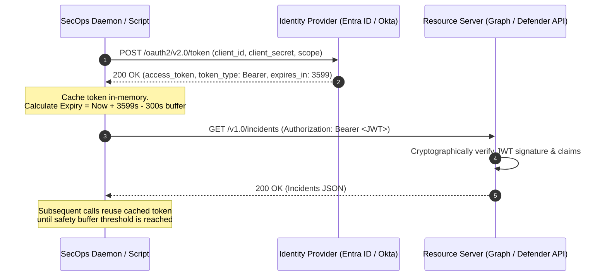
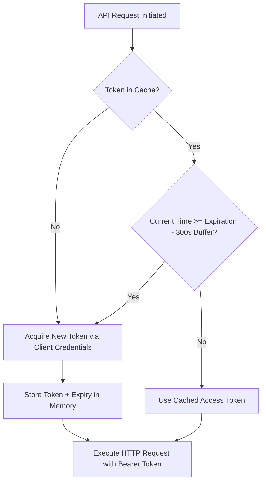

# Authentication & Token Lifecycles

Enterprise security APIs and cloud management planes do not use basic HTTP authentication or persistent static API keys in production. Instead, modern systems utilize **OAuth 2.0** token-based authentication with cryptographically signed **JSON Web Tokens (JWT)**. 

Reliable automation scripts must handle the complete token lifecycle: acquiring tokens via the client credentials grant, validating expiration claims, caching tokens in-memory with a safety refresh buffer, and recovering from credential rotation.

---

## OAuth 2.0 Core Concepts

OAuth 2.0 decouples authentication (verifying *who* an entity is) from authorization (verifying *what* an entity is permitted to execute).



### Grant Types in Enterprise Automation

| Grant Type | Identity Context | Execution Model | Common Use Case |
|:---|:---|:---|:---|
| **Client Credentials** | Service Principal / App Registration | Headless, unattended daemon script | Nightly SIEM ingestion, automated threat blocking, scheduled compliance scans. |
| **Authorization Code + PKCE** | Delegated User Identity | Interactive web or desktop client | Admin GUI tools where actions must be audited under the specific human administrator's account. |
| **Device Code Flow** | Delegated User Identity | Interactive CLI on headless or bastion host | Administrator authenticating on a Linux server without a browser. |
| **Certificate-Based Auth (mTLS)** | Service Principal via X.509 Certificate | Headless, high-assurance daemon | Enterprise tier production scripts requiring hardware-backed or Key Vault managed certificates instead of symmetric secrets. |

---

## Anatomy of a JSON Web Token (JWT)

A JWT is a string partitioned into three Base64URL-encoded parts separated by periods (`.`):

$$\text{JWT} = \text{Header} \,.\, \text{Payload} \,.\, \text{Signature}$$

```
eyJhbGciOiJSUzI1NiIsInR5cCI6IkpXVCJ9.
eyJhdWQiOiJodHRwczovL2FwaS5zb21lc2VydmljZS5jb20iLCJpc3MiOiJodHRwczovL2xvZ2luLm1pY3Jvc29mdG9ubGluZS5jb20vYWIxMi92Mi4wIiwiZXhwIjoxNzkxMzQ1NjAwLCJyb2xlcyI6WyJTZWN1cml0eUFsZXJ0LlJlYWRXcml0ZS5BbGwiXX0.
dGhpcy1pcy1hLWZha2Utc2lnbmF0dXJlLWZvci1kZW1vbnN0cmF0aW9uLW9ubHktZG8tbm90LXVzZQ
```

### Critical Payload Claims

Security engineers must understand standard JWT claims when troubleshooting authorization failures:

| Claim | Full Name | Description |
|:---|:---|:---|
| `aud` | **Audience** | The target API resource URI (e.g., `https://graph.microsoft.com` or `https://api.securitycenter.microsoft.com`). If this doesn't match the destination API, requests return `401 Unauthorized`. |
| `iss` | **Issuer** | The Identity Provider URL and tenant that generated the token (e.g., `https://login.microsoftonline.com/{tenantId}/v2.0`). |
| `exp` | **Expiration Time** | Unix epoch timestamp indicating when the token becomes invalid. |
| `nbf` | **Not Before** | Unix epoch timestamp indicating the start of validity. |
| `roles` | **Application Roles** | RBAC permissions assigned to the app registration in client credentials mode (e.g., `SecurityIncident.ReadWrite.All`). |
| `scp` | **Scopes** | Delegated permissions granted on behalf of a logged-in user (e.g., `User.ReadWrite.All`). |

---

## In-Memory Token Caching Pattern

> [!WARNING]
> **Anti-Pattern**: Requesting a brand new token before every single API call degrades script performance, increases network latency, and triggers identity provider rate limits (`AADSTS50196` or HTTP `429 Too Many Requests`).
> 
> **Best Practice**: Cache the token in memory and track its expiration. Always apply a **safety buffer** (typically 300 seconds / 5 minutes) to renew the token *before* it expires, eliminating mid-flight race conditions.



---

## Practical Examples

### 1. PowerShell: Thread-Safe In-Memory Token Manager

The following module implements a self-refreshing token cache supporting Entra ID and OAuth 2.0 endpoints:

```powershell
class OAuthTokenManager {
    [string]$TenantId
    [string]$ClientId
    [string]$ClientSecret
    [string]$Scope
    [string]$TokenEndpoint
    
    hidden [string]$CachedToken = $null
    hidden [datetime]$ExpirationTime = [datetime]::MinValue
    hidden [int]$BufferSeconds = 300  # Refresh 5 minutes before actual expiry

    OAuthTokenManager([string]$tenantId, [string]$clientId, [string]$clientSecret, [string]$scope) {
        $this.TenantId     = $tenantId
        $this.ClientId     = $clientId
        $this.ClientSecret = $clientSecret
        $this.Scope        = $scope
        $this.TokenEndpoint = "https://login.microsoftonline.com/$tenantId/oauth2/v2.0/token"
    }

    [string] GetToken() {
        # Check if current time is within valid window
        if ($this.CachedToken -and ([datetime]::UtcNow.AddSeconds($this.BufferSeconds) -lt $this.ExpirationTime)) {
            Write-Verbose "Using cached access token (Expires: $($this.ExpirationTime) UTC)"
            return $this.CachedToken
        }

        Write-Verbose "Acquiring new access token from $($this.TokenEndpoint)..."
        $body = @{
            client_id     = $this.ClientId
            client_secret = $this.ClientSecret
            scope         = $this.Scope
            grant_type    = 'client_credentials'
        }

        try {
            $response = Invoke-RestMethod -Method Post `
                                          -Uri $this.TokenEndpoint `
                                          -ContentType 'application/x-www-form-urlencoded' `
                                          -Body $body `
                                          -TimeoutSec 15

            $this.CachedToken = $response.access_token
            # Calculate absolute UTC expiration time
            $this.ExpirationTime = [datetime]::UtcNow.AddSeconds([int]$response.expires_in)
            
            Write-Verbose "New token acquired. Valid until $($this.ExpirationTime) UTC."
            return $this.CachedToken
        }
        catch {
            Write-Error "Failed to acquire OAuth token: $_"
            throw
        }
    }
}

# Usage Example:
# $tokenMgr = [OAuthTokenManager]::new($env:TENANT_ID, $env:CLIENT_ID, $env:CLIENT_SECRET, 'https://graph.microsoft.com/.default')
# $token = $tokenMgr.GetToken()
```

---

### 2. Python: Resilient Token Manager with Thread Safety

```python
import time
import threading
from typing import Dict, Any
import requests

class OAuth2TokenManager:
    """Thread-safe OAuth 2.0 Client Credentials token cache with proactive refresh."""
    def __init__(self, token_url: str, client_id: str, client_secret: str, scope: str, buffer_seconds: int = 300):
        self.token_url = token_url
        self.client_id = client_id
        self.client_secret = client_secret
        self.scope = scope
        self.buffer_seconds = buffer_seconds
        
        self._cached_token: str = ""
        self._expires_at: float = 0.0
        self._lock = threading.Lock()

    def get_token(self) -> str:
        now = time.time()
        # Fast non-blocking read
        if self._cached_token and (now + self.buffer_seconds < self._expires_at):
            return self._cached_token

        with self._lock:
            # Double-check inside synchronization lock
            if self._cached_token and (time.time() + self.buffer_seconds < self._expires_at):
                return self._cached_token

            payload = {
                "client_id": self.client_id,
                "client_secret": self.client_secret,
                "scope": self.scope,
                "grant_type": "client_credentials"
            }
            headers = {"Content-Type": "application/x-www-form-urlencoded"}

            response = requests.post(self.token_url, data=payload, headers=headers, timeout=15)
            response.raise_for_status()
            data: Dict[str, Any] = response.json()

            self._cached_token = data["access_token"]
            expires_in = int(data.get("expires_in", 3600))
            self._expires_at = time.time() + expires_in

            return self._cached_token
```

---

### 3. PowerShell: Pure JWT Payload Inspection & Claims Decoder

Decode and inspect token claims locally without sending tokens to third-party debugging websites:

```powershell
function ConvertFrom-JwtToken {
    [CmdletBinding()]
    param(
        [Parameter(Mandatory = $true)]
        [string]$JwtToken
    )

    $parts = $JwtToken.Split('.')
    if ($parts.Count -lt 2) {
        throw "Invalid JWT format. Expected at least header and payload segments."
    }

    # Helper function for base64url padding and decoding
    function Decode-Base64Url([string]$str) {
        $padded = $str.PadRight($str.Length + (4 - $str.Length % 4) % 4, '=')
        $bytes = [Convert]::FromBase64String($padded.Replace('-', '+').Replace('_', '/'))
        return [System.Text.Encoding]::UTF8.GetString($bytes)
    }

    $headerJson  = Decode-Base64Url $parts[0]
    $payloadJson = Decode-Base64Url $parts[1]

    $payload = $payloadJson | ConvertFrom-Json

    # Convert epoch expiration time to local and UTC datetime
    $expEpoch = $payload.exp
    $expDateUtc = [DateTimeOffset]::FromUnixTimeSeconds($expEpoch).UtcDateTime

    [PSCustomObject]@{
        Audience   = $payload.aud
        Issuer     = $payload.iss
        Roles      = $payload.roles
        Scopes     = $payload.scp
        ExpiresUtc = $expDateUtc
        IsExpired  = ([datetime]::UtcNow -gt $expDateUtc)
        Header     = ($headerJson | ConvertFrom-Json)
        Payload    = $payload
    }
}

# Example Usage:
# ConvertFrom-JwtToken -JwtToken $token | Format-List Audience, Issuer, Roles, ExpiresUtc, IsExpired
```

---

## Security Best Practices

1. **Never Hardcode Secrets**: Store client secrets in Azure Key Vault, AWS Secrets Manager, or Windows Credential Manager. Access them strictly at runtime via environment variables or managed identity.
2. **Prefer Managed Identities**: When running automation inside Azure (VMs, Automation Runbooks, Azure Functions) or AWS (EC2, ECS, Lambda), leverage **Managed Identities** / **IAM Roles** to eliminate static credentials completely.
3. **Use mTLS / Certificates for High Privilege Apps**: When app permissions require broad tenant write rights (e.g., `RoleManagement.ReadWrite.Directory`), configure X.509 certificate credentials rather than client secrets.
4. **Audit Scope Creep**: Enforce least-privilege API permissions. Do not grant `.ReadWrite.All` if the workflow only performs triage and read-only event correlation.

---

## Related References

- [REST Architecture & HTTP Semantics](rest-architecture.md) — HTTP verbs, idempotency, and status codes.
- [OAuth 2.0 Bearer Tokens](../../apis/authentication/bearer-tokens.md) — Production scripts for Entra ID and cloud API token acquisition.
- [Microsoft Defender Get Alerts](../../apis/microsoft-defender/get-alerts.md) — Real-world authenticated endpoint query with bearer tokens.
- [SentinelOne Threats API](../../apis/sentinelone/threats.md) — Authenticated threat operations using API token headers.
