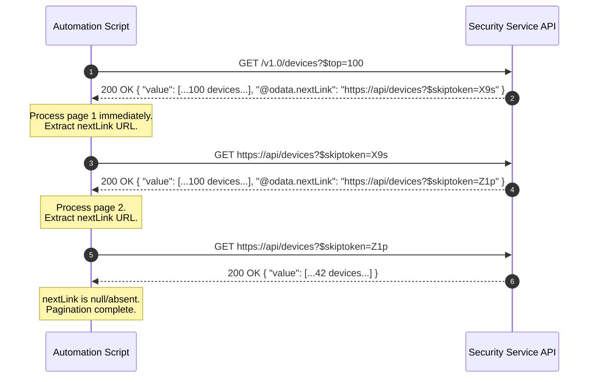

# Pagination & High-Volume Ingestion

When querying enterprise datasets—such as millions of audit logs, security alerts, or endpoint telemetry records—APIs never return all data in a single payload. Instead, data is segmented into **pages**.

Understanding pagination architectures (Offset vs. Cursor vs. OData `@odata.nextLink`) and streaming patterns is critical to avoid memory exhaustion, missing records due to data drift, or creating runaway infinite loops.

---

## Pagination Architectural Models

| Model | Mechanics | Pros | Cons / Vulnerabilities |
|:---|:---|:---|:---|
| **Offset & Limit** (`?skip=100&$top=50`) | Skips $N$ rows and returns the next $M$ records. | Intuitive; allows random access to specific page numbers. | **High database latency** at large offsets ($O(N)$ scan). **Data drift**: If records are added or deleted while paginating, items are duplicated or skipped entirely. |
| **Cursor / Keyset** (`?cursor=aWQiOjEwNDI=`) | Uses an indexed field (e.g., timestamp, record ID) as an opaque pointer to the next record. | **Fast, constant-time** performance ($O(1)$ index seek). **Zero data drift**: Unaffected by concurrent insertions or deletions. | Cannot jump to arbitrary pages; only supports sequential forward traversal. |
| **OData NextLink** (`@odata.nextLink`) | Server embeds a complete opaque URL pointing to the next dataset slice in the JSON response. | Client requires zero cursor parsing logic; simply invokes the provided URL. | Client must trust server-provided URL parameters and handle URL encoding properly. |



---

## Defensive Engineering Rules for Ingestion

1. **Enforce an Absolute Page Limit**: Never write an unbounded `while ($nextLink)` loop without a safety break counter. A bug in backend cursor generation can lead to circular links and infinite billing / execution loops.
2. **Stream, Do Not Accumulate**: Avoid storing tens of thousands of complex objects in a single in-memory array (`$allObjects += $page.value`). Accumulating millions of objects causes Out-Of-Memory (OOM) crashes. Instead, emit objects down the PowerShell pipeline or write them to disk / message queues per page.
3. **Respect Transient Retries on Intermediate Pages**: If page 48 out of 50 fails with a network glitch or a 429 throttle, retry that specific page URL rather than restarting the entire 50-page crawl from scratch.

---

## Practical Examples

### 1. PowerShell: High-Performance OData `@odata.nextLink` Streamer

This pattern consumes Microsoft Graph or Defender APIs, streaming records down the pipeline item-by-item with safety counters and throttling tolerance:

```powershell
function Invoke-ODataPagedQuery {
    [CmdletBinding()]
    param(
        [Parameter(Mandatory = $true)]
        [string]$InitialUri,

        [Parameter(Mandatory = $true)]
        [string]$BearerToken,

        [Parameter(Mandatory = $false)]
        [int]$MaxPages = 100
    )

    $currentUri = $InitialUri
    $pageCount = 0
    $totalRecords = 0

    $headers = @{
        "Authorization"   = "Bearer $BearerToken"
        "Accept"          = "application/json"
        "ConsistencyLevel"= "eventual"
    }

    while ($currentUri) {
        $pageCount++
        if ($pageCount -gt $MaxPages) {
            Write-Warning "Safety ceiling reached: Stopped after processing $MaxPages pages."
            break
        }

        Write-Verbose "Fetching page $pageCount from: $currentUri"

        try {
            $response = Invoke-RestMethod -Uri $currentUri -Method Get -Headers $headers -TimeoutSec 30
        }
        catch {
            Write-Error "Failed to fetch page $pageCount : $_"
            throw
        }

        # Validate standard OData array property
        if ($response.value) {
            foreach ($item in $response.value) {
                $totalRecords++
                # Emit each object directly into the PowerShell pipeline
                Write-Output $item
            }
        }

        # Microsoft Graph OData nextLink check
        if ($response.'@odata.nextLink') {
            $currentUri = $response.'@odata.nextLink'
        }
        else {
            $currentUri = $null
        }
    }

    Write-Verbose "Pagination complete. Processed $totalRecords records across $pageCount pages."
}

# Usage:
# Invoke-ODataPagedQuery -InitialUri "https://graph.microsoft.com/v1.0/users?`$top=999" -BearerToken $token |
#     Where-Object { $_.accountEnabled -eq $true } |
#     Export-Csv -Path "active_users.csv" -NoTypeInformation
```

---

### 2. Python: Memory-Efficient Cursor Generator (`yield from`)

Using Python generators ensures that memory consumption remains constant regardless of whether you ingest 1,000 or 1,000,000 items:

```python
from typing import Generator, Dict, Any, Optional
import requests

def stream_cursor_paginated_api(
    base_url: str,
    headers: Dict[str, str],
    max_pages: int = 500
) -> Generator[Dict[str, Any], None, None]:
    """
    Generator that sequentially queries cursor-paginated endpoints
    and yields records one by one without accumulating full datasets in memory.
    """
    cursor: Optional[str] = None
    page_count = 0

    with requests.Session() as session:
        session.headers.update(headers)

        while True:
            page_count += 1
            if page_count > max_pages:
                print(f"[WARN] Maximum page limit of {max_pages} reached. Stopping.")
                break

            params = {"limit": 100}
            if cursor:
                params["cursor"] = cursor

            resp = session.get(base_url, params=params, timeout=25)
            resp.raise_for_status()
            data = resp.json()

            # Yield individual records
            records = data.get("data", [])
            for record in records:
                yield record

            # Extract cursor for next iteration
            pagination = data.get("pagination", {})
            cursor = pagination.get("next_cursor")

            # Terminate if cursor is missing, null, or empty
            if not cursor:
                break

# Example Usage:
# headers = {"Authorization": "Bearer token_secret"}
# for record in stream_cursor_paginated_api("https://api.sentinelone.net/web/api/v2.1/agents", headers):
#     if record.get("networkStatus") == "disconnected":
#         print(f"Stale Agent: {record.get('computerName')}")
```

---

### 3. SentinelOne S1QL Cursor Ingestion

SentinelOne Deep Visibility queries use a two-step polling and cursor pattern:

```bash
# 1. Initiate query and retrieve queryId
curl -X POST "https://customer.sentinelone.net/web/api/v2.1/dv/init-query" \
  -H "Authorization: ApiToken $S1_API_TOKEN" \
  -H "Content-Type: application/json" \
  -d '{"query": "EndpointOS = \"windows\" AND EventType = \"Process Creation\"", "fromDate": "2026-10-01T00:00:00Z"}'

# 2. Retrieve initial results page and cursor
curl -X GET "https://customer.sentinelone.net/web/api/v2.1/dv/events?queryId=123456789&limit=1000" \
  -H "Authorization: ApiToken $S1_API_TOKEN"

# 3. Retrieve next page using the cursor returned in the previous response
curl -X GET "https://customer.sentinelone.net/web/api/v2.1/dv/events?queryId=123456789&limit=1000&cursor=eyJzb3J0VmFsdWUiOjk5OTl9" \
  -H "Authorization: ApiToken $S1_API_TOKEN"
```

---

## Related References

- [REST Architecture & HTTP Semantics](rest-architecture.md) — HTTP query parameters and status codes.
- [Rate Limiting & Exponential Backoff](rate-limiting-backoff.md) — Mitigating throttling when crawling large paginated collections.
- [Microsoft Graph Sign-In Logs](../../apis/microsoft-graph/sign-in-logs.md) — Practical OData queries and paged log ingestion.
- [SentinelOne Threats API](../../apis/sentinelone/threats.md) — Paged threat record extraction and cursor patterns.
