# Rate Limiting & Exponential Backoff

All enterprise cloud services and security platforms enforce rate limits to protect backend clusters from starvation, noisy neighbors, and cascading outages. When automated pipelines exceed quota thresholds, services issue **HTTP 429 (Too Many Requests)** or **HTTP 503 (Service Unavailable)**.

Production integrations must gracefully interpret rate-limit headers, parse `Retry-After` signals, and implement **exponential backoff with full jitter** to prevent systemic retry storms.

---

## Rate Limiting Algorithms

Cloud gateways (e.g., Azure Front Door, AWS API Gateway, Cloudflare) implement specific traffic-shaping algorithms:

| Algorithm | How It Works | Failure Pattern |
|:---|:---|:---|
| **Token Bucket** | Tokens accumulate at a constant rate up to a max bucket size. Each request consumes one or more tokens. | Allows short bursts of high traffic; requests fail with 429 once tokens deplete until replenishment. |
| **Leaky Bucket** | Requests enter a FIFO queue processed at a constant leak rate. | Smooths out bursts into a uniform stream; overflows immediately when queue fills. |
| **Fixed Window Counter** | Limits requests per fixed time block (e.g., 10,000 requests per 10-minute window). | Vulnerable to "boundary burst": 10k requests at 09:59 and 10k requests at 10:01 overwhelm the backend. |
| **Sliding Window Log / Counter** | Computes the request count across a sliding relative time frame (e.g., previous 60 seconds from current millisecond). | Prevents boundary spikes; strictly enforces moving quota thresholds. |

---

## Rate Limit Response Headers

When inspecting HTTP responses, APIs communicate quota health and throttling instructions via standard and vendor-specific headers:

| Header | Meaning / Format | Action |
|:---|:---|:---|
| **`Retry-After`** | Integer seconds (`Retry-After: 30`) or HTTP-date (`Retry-After: Fri, 31 Dec 2026 23:59:59 GMT`). | **Mandatory pause**: Script must pause execution for at least this duration before reissuing the request. |
| **`X-RateLimit-Limit`** | Maximum allowed requests within the current quota period. | Use for capacity planning and setting client-side pacing throttles. |
| **`X-RateLimit-Remaining`** | Number of requests remaining in current window. | If nearing zero (<5%), slow down requests proactively. |
| **`X-RateLimit-Reset`** | Unix epoch or delta seconds until quota resets completely. | Calculate client sleep time if burst budget is exhausted. |

---

## Backoff Strategies & The Thundering Herd Problem

When multiple automation workers fail simultaneously and retry on fixed intervals (e.g., every 5 seconds), they hit the API at the exact same millisecond—perpetuating the throttle in an endless loop known as the **Thundering Herd problem**.

### The Jitter Solution

AWS Architecture research demonstrated that adding **randomization (jitter)** to exponential backoff breaks synchronization between competing clients:

$$\text{Pure Exponential Backoff:} \quad t_{\text{sleep}} = \min(t_{\text{max}}, \, t_{\text{base}} \times 2^{\text{attempt}})$$

$$\text{Full Jitter Formula:} \quad t_{\text{sleep}} = \text{random}(0, \, \min(t_{\text{max}}, \, t_{\text{base}} \times 2^{\text{attempt}}))$$

```mermaid
gantt
    title Thundering Herd vs. Full Jitter Stagger
    dateFormat X
    axisFormat %s sec
    
    section Without Jitter
    Worker A (Attempt 1 Retry) :crit, 0, 10
    Worker B (Attempt 1 Retry) :crit, 0, 10
    Worker C (Attempt 1 Retry) :crit, 0, 10
    
    section With Full Jitter
    Worker A (Random Delay)    :active, 0, 3
    Worker B (Random Delay)    :active, 0, 7
    Worker C (Random Delay)    :active, 0, 9
```



---

## Practical Examples

### 1. PowerShell: Resilient Request Invoker with Retry-After & Full Jitter

```powershell
function Invoke-ResilientRestMethod {
    [CmdletBinding()]
    param(
        [Parameter(Mandatory = $true)]
        [Uri]$Uri,

        [Parameter(Mandatory = $false)]
        [string]$Method = 'GET',

        [Parameter(Mandatory = $false)]
        [hashtable]$Headers = @{},

        [Parameter(Mandatory = $false)]
        [string]$Body,

        [Parameter(Mandatory = $false)]
        [int]$MaxRetries = 5,

        [Parameter(Mandatory = $false)]
        [int]$BaseDelaySeconds = 2,

        [Parameter(Mandatory = $false)]
        [int]$MaxDelaySeconds = 60
    )

    $attempt = 0

    while ($attempt -le $MaxRetries) {
        try {
            $params = @{
                Uri         = $Uri
                Method      = $Method
                Headers     = $Headers
                TimeoutSec  = 30
            }
            if ($Body) {
                $params['Body'] = $Body
                $params['ContentType'] = 'application/json; charset=utf-8'
            }

            return (Invoke-RestMethod @params)
        }
        catch [Microsoft.PowerShell.Commands.HttpResponseException] {
            $statusCode = [int]$_.Response.StatusCode
            $headers = $_.Response.Headers

            # Check if status is throttled (429) or transient server error (500, 502, 503, 504)
            if ($statusCode -eq 429 -or ($statusCode -ge 500 -and $statusCode -le 504)) {
                $attempt++
                if ($attempt -gt $MaxRetries) {
                    Write-Error "Exceeded maximum retry attempts ($MaxRetries). HTTP $statusCode."
                    throw
                }

                # Evaluate Retry-After header if provided by server
                $retryAfterSeconds = $null
                if ($headers.Contains('Retry-After')) {
                    $retryHeaderVal = ($headers.GetValues('Retry-After') | Select-Object -First 1)
                    if ([int]::TryParse($retryHeaderVal, [ref]$retryAfterSeconds)) {
                        Write-Verbose "Server supplied Retry-After: $retryAfterSeconds seconds."
                    }
                }

                if ($retryAfterSeconds) {
                    # Add small random jitter (0.5 to 2.0s) to server recommendation
                    $sleepTime = $retryAfterSeconds + (Get-Random -Minimum 1 -Maximum 3)
                }
                else {
                    # Calculate exponential backoff with full jitter: random(0, min(max, base * 2^attempt))
                    $expCap = [Math]::Min($MaxDelaySeconds, ($BaseDelaySeconds * [Math]::Pow(2, $attempt)))
                    $sleepTime = [Math]::Round((Get-Random -Minimum 1.0 -Maximum [double]$expCap), 2)
                }

                Write-Warning "Encountered HTTP $statusCode on attempt $attempt/$MaxRetries. Backing off for $sleepTime seconds..."
                Start-Sleep -Seconds $sleepTime
            }
            else {
                # Non-transient client error (400, 401, 403, 404). Do NOT retry.
                Write-Error "Unrecoverable client error HTTP $statusCode."
                throw
            }
        }
        catch {
            Write-Error "Unexpected transport failure: $_"
            throw
        }
    }
}
```

---

### 2. Python: Production Decorator with Full Jitter

```python
import functools
import logging
import random
import time
from typing import Callable, Any
import requests

logger = logging.getLogger("RateLimitBackoff")

def with_exponential_backoff(
    max_retries: int = 5,
    base_delay: float = 1.5,
    max_delay: float = 45.0,
    retryable_statuses: tuple = (429, 500, 502, 503, 504)
) -> Callable:
    """Decorator applying exponential backoff with full jitter and Retry-After header evaluation."""
    def decorator(func: Callable) -> Callable:
        @functools.wraps(func)
        def wrapper(*args, **kwargs) -> Any:
            attempt = 0
            while True:
                try:
                    return func(*args, **kwargs)
                except requests.exceptions.RequestException as exc:
                    resp = getattr(exc, "response", None)
                    status_code = resp.status_code if resp is not None else None

                    if status_code in retryable_statuses and attempt < max_retries:
                        attempt += 1
                        server_retry_after = None

                        if resp is not None and "Retry-After" in resp.headers:
                            try:
                                server_retry_after = float(resp.headers["Retry-After"])
                            except ValueError:
                                pass

                        if server_retry_after is not None:
                            sleep_duration = server_retry_after + random.uniform(0.5, 2.0)
                        else:
                            # AWS Full Jitter: random between 0 and min(max_delay, base * 2^attempt)
                            backoff_limit = min(max_delay, base_delay * (2 ** attempt))
                            sleep_duration = random.uniform(0.1, backoff_limit)

                        logger.warning(
                            f"HTTP {status_code} received on attempt {attempt}/{max_retries}. "
                            f"Sleeping {sleep_duration:.2f}s before retry."
                        )
                        time.sleep(sleep_duration)
                    else:
                        logger.error(f"Request failed critically or exceeded retries: {exc}")
                        raise
        return wrapper
    return decorator

# Usage:
# @with_exponential_backoff(max_retries=4)
# def fetch_sentinelone_threats():
#     return requests.get("https://customer.sentinelone.net/web/api/v2.1/threats", timeout=15)
```

---

### 3. Proactive Client Pacing (Token Bucket Throttler)

Rather than waiting for the API to issue a `429`, high-volume bulk scripts should throttle their dispatch rate client-side:

```python
class ClientSideRateLimiter:
    """Simple client-side rate limiter enforcing maximum operations per second."""
    def __init__(self, requests_per_second: float):
        self.interval = 1.0 / requests_per_second
        self.last_request_time = 0.0

    def wait(self):
        now = time.time()
        elapsed = now - self.last_request_time
        if elapsed < self.interval:
            time.sleep(self.interval - elapsed)
        self.last_request_time = time.time()

# Example: Enforce maximum 10 requests per second
# limiter = ClientSideRateLimiter(requests_per_second=10.0)
# for item in bulk_items:
#     limiter.wait()
#     dispatch_api_call(item)
```

---

## Related References

- [REST Architecture & HTTP Semantics](rest-architecture.md) — HTTP status codes and transport semantics.
- [Pagination & High-Volume Ingestion](pagination.md) — Handling paginated streams safely alongside rate limits.
- [Defender Get Alerts](../../apis/microsoft-defender/get-alerts.md) — Real-world Defender API integration with built-in throttling handling.
- [SentinelOne Threats API](../../apis/sentinelone/threats.md) — Throttling considerations during threat telemetry extraction.
