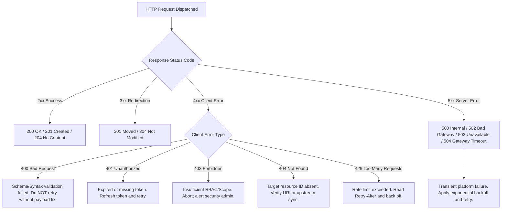

# REST Architecture & HTTP Semantics

Representational State Transfer (REST) is the foundational architectural style powering modern web services, cloud infrastructure management, and security platform integrations. Understanding HTTP protocol semantics, verb idempotency, and status code taxonomies is required to build resilient automation pipelines and diagnose integration failures across enterprise platforms such as Microsoft Graph, Defender XDR, and SentinelOne.

---

## Architectural Principles

REST is defined by six architectural constraints designed to optimize scalability, reliability, and modularity:

| Constraint | Operational Meaning | Real-World Impact |
|:---|:---|:---|
| **Client-Server** | Separation of user interface/client state from storage and business logic. | Clients and servers evolve independently; API versions remain stable. |
| **Statelessness** | Every request contains all context needed for processing. No session affinity stored server-side. | Load balancers can route requests across any backend instance; authentication is verified per request via tokens. |
| **Cacheability** | Responses must explicitly define whether they are cacheable (`Cache-Control`, `ETag`). | Dramatically reduces egress bandwidth and latency for static metadata (e.g., tenant tenant SKUs, user profiles). |
| **Uniform Interface** | Predictable URI schemas, standardized media types (`application/json`), and standard HTTP methods. | Developers and tools interact with varied services (Azure, AWS, Splunk) using uniform conventions. |
| **Layered System** | The client cannot assume direct connection to the end server; requests pass through proxies, gateways, and CDNs. | Enables zero-trust proxies, SSL offloading, rate-limiting gateways, and reverse proxies (e.g., Cloudflare, Azure API Management). |
| **Code on Demand (Optional)** | Servers can dynamically deliver executable code (e.g., JavaScript). | Rarely used in backend enterprise and security APIs. |

---

## HTTP Verbs, Safety, & Idempotency

Understanding whether an HTTP method is **Safe** (does not alter server state) and **Idempotent** (multiple identical requests produce the same end server state as a single request) is critical when engineering retry mechanisms and failure recovery routines.

| Method | Safe | Idempotent | RFC Semantics | Common Enterprise Use Case |
|:---|:---:|:---:|:---|:---|
| `GET` | Yes | Yes | Retrieve resource representation without side effects. | Querying Defender alerts, fetching user profiles. |
| `HEAD` | Yes | Yes | Identical to `GET` but returns headers only without message body. | Checking if a large export file exists or validating `ETag` without bandwidth overhead. |
| `POST` | No | No | Submit entity to resource collection; creates child resource or triggers action. | Isolating an endpoint, creating a new incident, running KQL queries. |
| `PUT` | No | Yes | Replace the target resource entirely with the request payload. | Overwriting an entire configuration policy or replacing device tag arrays. |
| `PATCH` | No | No* | Apply partial modifications to a resource. | Updating incident status (`inProgress` -> `resolved`) or changing user phone number. |
| `DELETE` | No | Yes | Remove the specified resource. | Deleting a stale indicator of compromise (IoC) or expiring an access rule. |
| `OPTIONS`| Yes | Yes | Describe communication options for target resource (CORS preflight). | Inspecting allowed HTTP verbs and headers supported by an endpoint. |

*> *Note on PATCH*: While RFC 5789 allows non-idempotent patches (e.g., appending items to a list), most REST APIs design PATCH updates to be effectively idempotent. Retries must still be handled cautiously.

---

## HTTP Status Code Diagnostic Matrix

Status codes communicate the outcome of the request. Automation scripts must evaluate status classes and handle specific error patterns gracefully.



| Range | Class | Key Codes & Operational Meaning |
|:---|:---|:---|
| **2xx** | **Success** | **`200 OK`**: Standard success with body.<br>**`201 Created`**: Resource created; includes `Location` header.<br>**`204 No Content`**: Action succeeded, no payload returned (standard for `DELETE` or state changes). |
| **3xx** | **Redirection** | **`301 Moved Permanently`**: Update script endpoint URI.<br>**`304 Not Modified`**: Client cache remains valid; no payload transferred. |
| **4xx** | **Client Error** | **`400 Bad Request`**: Malformed JSON or schema error.<br>**`401 Unauthorized`**: Missing/expired token; triggers token refresh.<br>**`403 Forbidden`**: Valid identity, but missing API application permissions/RBAC.<br>**`404 Not Found`**: Resource does not exist.<br>**`409 Conflict`**: Version conflict or concurrency violation (e.g., conflicting `If-Match` ETag).<br>**`422 Unprocessable`**: Syntax valid, semantic business validation failed.<br>**`429 Too Many Requests`**: Rate limit throttled; requires backoff. |
| **5xx** | **Server Error** | **`500 Internal Error`**: Upstream service crashed.<br>**`502 Bad Gateway`**: Edge proxy received invalid response from backend.<br>**`503 Service Unavailable`**: Server overwhelmed or under maintenance.<br>**`504 Gateway Timeout`**: Upstream query exceeded reverse proxy timeout window. |

---

## Practical Examples

### 1. PowerShell: Standardized REST Client with Diagnostic Headers

PowerShell's `Invoke-RestMethod` and `Invoke-WebRequest` provide native HTTP client capabilities. The following pattern illustrates robust header injection, request correlation tracing, and error extraction.

```powershell
# Standardized REST Client Function with Correlation ID
function Invoke-SecApiRequest {
    [CmdletBinding()]
    param(
        [Parameter(Mandatory = $true)]
        [Uri]$Uri,

        [Parameter(Mandatory = $false)]
        [ValidateSet('GET', 'POST', 'PATCH', 'PUT', 'DELETE')]
        [string]$Method = 'GET',

        [Parameter(Mandatory = $false)]
        [hashtable]$Body,

        [Parameter(Mandatory = $true)]
        [string]$BearerToken
    )

    # Inject standard headers including Correlation ID for distributed tracing
    $correlationId = [guid]::NewGuid().ToString()
    $headers = @{
        "Authorization"   = "Bearer $BearerToken"
        "Accept"          = "application/json"
        "client-request-id" = $correlationId
        "User-Agent"      = "SecOps-Automation/2.4 (PowerShell 7)"
    }

    $splat = @{
        Uri         = $Uri
        Method      = $Method
        Headers     = $headers
        ContentType = "application/json; charset=utf-8"
        TimeoutSec  = 30
    }

    if ($Body -and $Method -in @('POST', 'PATCH', 'PUT')) {
        $splat['Body'] = ($Body | ConvertTo-Json -Depth 10 -Compress)
    }

    try {
        Write-Verbose "Dispatching $Method to $Uri [CorrelationID: $correlationId]"
        $response = Invoke-RestMethod @splat
        return $response
    }
    catch [Microsoft.PowerShell.Commands.HttpResponseException] {
        $statusCode = [int]$_.Response.StatusCode
        $statusDescription = $_.Response.ReasonPhrase
        Write-Error "HTTP $statusCode ($statusDescription) encountered on $Method $Uri [Trace: $correlationId]"
        
        # Read error payload from response stream
        $rawError = $_.ErrorDetails.Message
        if ($rawError) {
            Write-Warning "Remote Error Body: $rawError"
        }
        throw
    }
    catch {
        Write-Error "Transport error connecting to $Uri : $_"
        throw
    }
}
```

---

### 2. Python: Resilient Session with Connection Pooling & Serialization

Python scripts should use `requests.Session` or `httpx.Client` to leverage TCP connection pooling and keep-alive connections rather than instantiating new sockets per call.

```python
import json
import logging
import uuid
from typing import Any, Dict, Optional
import requests
from requests.adapters import HTTPAdapter
from urllib3.util.retry import Retry

logging.basicConfig(level=logging.INFO, format="%(asctime)s [%(levelname)s] %(message)s")
logger = logging.getLogger("SecOpsApiClient")

class ResilientApiClient:
    def __init__(self, base_url: str, token: str):
        self.base_url = base_url.rstrip("/")
        self.session = requests.Session()
        
        # Configure connection pooling and default transport retries for 5xx errors
        retries = Retry(
            total=3,
            backoff_factor=1.0,
            status_forcelist=[500, 502, 503, 504],
            allowed_methods=["GET", "HEAD", "OPTIONS"]
        )
        adapter = HTTPAdapter(pool_connections=10, pool_maxsize=25, max_retries=retries)
        self.session.mount("https://", adapter)
        
        # Set default headers
        self.session.headers.update({
            "Authorization": f"Bearer {token}",
            "Accept": "application/json",
            "Content-Type": "application/json; charset=utf-8",
            "User-Agent": "SecOps-Python-Pipeline/1.2"
        })

    def request(self, method: str, endpoint: str, payload: Optional[Dict[str, Any]] = None) -> Dict[str, Any]:
        url = f"{self.base_url}/{endpoint.lstrip('/')}"
        req_id = str(uuid.uuid4())
        custom_headers = {"client-request-id": req_id}

        data_str = json.dumps(payload) if payload else None
        logger.info(f"Dispatching {method} {url} [Request-ID: {req_id}]")

        try:
            resp = self.session.request(
                method=method,
                url=url,
                data=data_str,
                headers=custom_headers,
                timeout=(3.05, 27.0)  # (connect timeout, read timeout)
            )

            # Raise HTTPError for 4xx and 5xx responses
            resp.raise_for_status()

            if resp.status_code == 204:
                return {}
            return resp.json()

        except requests.exceptions.HTTPError as http_err:
            logger.error(f"HTTP {resp.status_code} on {method} {url}: {resp.text}")
            raise
        except requests.exceptions.Timeout as timeout_err:
            logger.error(f"Timeout reached contacting {url}: {timeout_err}")
            raise
        except requests.exceptions.RequestException as req_err:
            logger.error(f"Network transport failure on {url}: {req_err}")
            raise
```

---

### 3. cURL: Diagnostic Command Patterns

Use cURL directly on Linux or Windows CMD/PowerShell to troubleshoot TLS handshakes, response headers, and exact payload bytes without script abstraction overhead:

```bash
# Verbose TLS handshake, timing metrics, and full response headers
curl -iv -w "\nHTTP: %{http_code} | Total: %{time_total}s | DNS: %{time_namelookup}s | Connect: %{time_connect}s\n" \
  -X GET "https://graph.microsoft.com/v1.0/me" \
  -H "Authorization: Bearer $ACCESS_TOKEN" \
  -H "Accept: application/json"

# POST JSON payload and print HTTP response headers directly to stdout
curl -i -X POST "https://api.security.microsoft.com/api/indicators" \
  -H "Authorization: Bearer $ACCESS_TOKEN" \
  -H "Content-Type: application/json" \
  -d '{
    "indicatorValue": "198.51.100.25",
    "indicatorType": "IpAddress",
    "action": "AlertAndBlock",
    "title": "C2 Threat Feed Ingestion"
  }'
```

---

## Related References

- [Authentication & Token Lifecycles](auth-tokens.md) — OAuth 2.0 client credentials, JWT token anatomy, and in-memory token refresh buffers.
- [Rate Limiting & Exponential Backoff](rate-limiting-backoff.md) — Handling HTTP 429 throttling and dynamic backoff calculations.
- [Pagination & High-Volume Ingestion](pagination.md) — Cursor-based streaming and OData `@odata.nextLink` handling.
- [Microsoft Graph Sign-In Logs](../../apis/microsoft-graph/sign-in-logs.md) — Real-world REST implementation for querying identity telemetry.
- [Defender Get Alerts API](../../apis/microsoft-defender/get-alerts.md) — REST patterns for querying security incidents and alerts.
