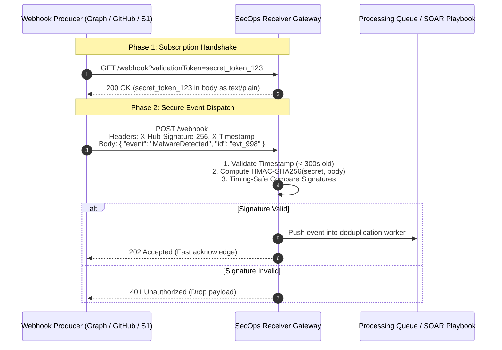

# Webhooks & Event-Driven Architecture

Traditional polling architectures query an API on a recurring timer (e.g., every 60 seconds) to check for new alerts or changes. This consumes excessive compute, exhausts API rate limits, and introduces polling latency.

**Webhooks** reverse this paradigm using an event-driven **Push** model: the upstream service (e.g., Microsoft Graph, GitHub, SentinelOne) immediately issues an HTTP `POST` to your listener when an event occurs.

Securing webhook endpoints requires cryptographic **HMAC-SHA256 signature verification**, **timestamp replay defenses**, and **idempotent event processing**.

---

## Push vs. Poll Architecture Comparison

```mermaid
graph LR
    subgraph Polling Model (High Overhead)
        A1[Script / Cron] -->|GET /alerts every 30s| S1[Security API]
        S1 -->|99% of responses: Empty 200 OK| A1
    end

    subgraph Webhook Model (Real-Time Push)
        S2[Security API] -->|POST /webhook on Detection Event| A2[SecOps Listener Endpoint]
        A2 -->|200 OK + Immediate Playbook Execution| S2
    end
```

| Metric | Polling Model | Webhook / Event-Driven Model |
|:---|:---|:---|
| **Detection Latency** | $\ge \text{Polling Interval}$ (up to minutes) | Sub-second real-time delivery |
| **API Rate Quota Impact** | Continuously burns API quota on empty checks | Zero quota consumed during idle periods |
| **Compute / Bandwidth** | Continuous network and CPU utilization | Event-triggered execution (serverless/microservice friendly) |
| **Security Complexity** | Outbound HTTPS only; minimal firewall needs | Requires public ingress endpoint protected by cryptographic validation |

---

## Anatomy of a Secure Webhook Lifecycle



---

## Cryptographic Security Requirements

### 1. HMAC SHA-256 Signature Verification
To guarantee that incoming payloads originate from the authentic service and have not been tampered with in transit:
1. Both parties share a pre-shared secret key.
2. The sender computes:
   $$\text{Signature} = \text{HMAC-SHA256}(\text{Secret}, \text{Raw Request Body})$$
3. The sender transmits the signature in a header (e.g., `X-Hub-Signature-256` or `X-Signature-SHA256`).
4. The receiver computes the exact same hash across the unparsed raw bytes and performs a **constant-time string comparison** to prevent timing attacks.

### 2. Replay Attack Prevention
Attackers can capture an authorized webhook request and replay it to trigger repeated automated actions (e.g., isolating a host repeatedly).
- **Rule**: Require an `X-Timestamp` header in the request. If the difference between current time and the timestamp exceeds 300 seconds (5 minutes), reject the request.

### 3. "At-Least-Once" Delivery & Idempotency
Cloud webhook producers prioritize delivery reliability. If an endpoint takes longer than 5 seconds to respond, the producer assumes delivery failed and retries.
- **Rule**: Return HTTP `200` or `202 Accepted` immediately after storing the event in a queue. Process heavy playbook logic asynchronously.
- **Rule**: Track incoming event IDs in Redis or a database to discard duplicate deliveries.

---

## Practical Examples

### 1. PowerShell: HMAC-SHA256 Payload Signature Verifier

```powershell
function Test-WebhookHmacSignature {
    [CmdletBinding()]
    param(
        [Parameter(Mandatory = $true)]
        [string]$RawPayload,

        [Parameter(Mandatory = $true)]
        [string]$ReceivedSignature,  # Expected format: "sha256=abcdef..." or raw hex

        [Parameter(Mandatory = $true)]
        [string]$SharedSecret
    )

    # Normalize incoming signature string
    $cleanSignature = $ReceivedSignature -replace '^sha256=', ''

    # Initialize HMAC-SHA256 with UTF-8 secret
    $secretBytes = [System.Text.Encoding]::UTF8.GetBytes($SharedSecret)
    $payloadBytes = [System.Text.Encoding]::UTF8.GetBytes($RawPayload)

    $hmac = [System.Security.Cryptography.HMACSHA256]::new($secretBytes)
    $hashBytes = $hmac.ComputeHash($payloadBytes)
    $computedHex = [System.BitConverter]::ToString($hashBytes).Replace('-', '').ToLowerInvariant()

    # Timing-safe comparison using CryptographicOperations (prevents timing side-channel attacks)
    $computedBytes = [System.Text.Encoding]::UTF8.GetBytes($computedHex)
    $receivedBytes = [System.Text.Encoding]::UTF8.GetBytes($cleanSignature.ToLowerInvariant())

    $isValid = [System.Security.Cryptography.CryptographicOperations]::FixedTimeEquals(
        $computedBytes, 
        $receivedBytes
    )

    return $isValid
}

# Example Usage:
# $isValid = Test-WebhookHmacSignature -RawPayload $rawBody -ReceivedSignature $headers['X-Signature-256'] -SharedSecret $env:WEBHOOK_SECRET
# if (-not $isValid) { Write-Error "Invalid webhook HMAC signature! Dropping request." }
```

---

### 2. Python: Production FastAPI Webhook Listener

This FastAPI implementation demonstrates webhook validation handshakes (Microsoft Graph compatible), HMAC signature verification, and timestamp drift checking:

```python
import hmac
import hashlib
import time
from fastapi import FastAPI, Request, HTTPException, Header, Response
from fastapi.responses import PlainTextResponse

app = FastAPI(title="SecOps Webhook Receiver")
WEBHOOK_SHARED_SECRET = "super-secret-pre-shared-key-replace-in-prod".encode("utf-8")
MAX_ALLOWED_DRIFT_SECONDS = 300

@app.get("/api/v1/webhook", response_class=PlainTextResponse)
async def validate_subscription(validationToken: str = ""):
    """
    Microsoft Graph subscription validation handshake.
    Graph sends a GET with a validationToken query param; listener must return it as plain text.
    """
    if not validationToken:
        raise HTTPException(status_code=400, detail="Missing validation token")
    return validationToken

@app.post("/api/v1/webhook")
async def receive_webhook_event(
    request: Request,
    x_signature_256: str = Header(None),
    x_timestamp: str = Header(None)
):
    # 1. Validate Timestamp to prevent Replay Attacks
    if x_timestamp:
        try:
            req_time = float(x_timestamp)
            if abs(time.time() - req_time) > MAX_ALLOWED_DRIFT_SECONDS:
                raise HTTPException(status_code=400, detail="Request timestamp drift exceeded allowable window")
        except ValueError:
            raise HTTPException(status_code=400, detail="Invalid timestamp format")

    # 2. Read Raw Payload Bytes (MUST be unparsed raw bytes)
    raw_body = await request.body()

    # 3. Verify HMAC-SHA256 Signature
    if not x_signature_256:
        raise HTTPException(status_code=401, detail="Missing HMAC signature header")

    computed_hmac = hmac.new(WEBHOOK_SHARED_SECRET, raw_body, hashlib.sha256).hexdigest()
    expected_sig = x_signature_256.removeprefix("sha256=")

    # Timing-safe constant-time string comparison
    if not hmac.compare_digest(computed_hmac, expected_sig):
        raise HTTPException(status_code=401, detail="Invalid signature verification failed")

    # 4. Parse JSON and Dispatch to Worker
    event_data = await request.json()
    print(f"[INFO] Successfully verified and received event: {event_data.get('eventType')}")

    # Return fast 202 Accepted
    return {"status": "accepted", "event_id": event_data.get("id")}
```

---

### 3. cURL: Simulating Webhook Event with Calculated Signature

Generate an HMAC SHA-256 signature via command-line tools to test webhook listeners during development:

```bash
# 1. Define secret and payload
SECRET="super-secret-pre-shared-key-replace-in-prod"
PAYLOAD='{"eventType":"AlertTriggered","severity":"High","hostId":"SRV-SQL-01"}'

# 2. Compute HMAC SHA-256 in hex
SIGNATURE=$(echo -n "$PAYLOAD" | openssl dgst -sha256 -hmac "$SECRET" | awk '{print $2}')
TIMESTAMP=$(date +%s)

# 3. Dispatch simulated webhook request
curl -i -X POST "http://localhost:8000/api/v1/webhook" \
  -H "Content-Type: application/json" \
  -H "X-Signature-256: sha256=$SIGNATURE" \
  -H "X-Timestamp: $TIMESTAMP" \
  -d "$PAYLOAD"
```

---

## Related References

- [REST Architecture & HTTP Semantics](rest-architecture.md) — HTTP status codes and transport semantics.
- [Authentication & Token Lifecycles](auth-tokens.md) — Managing API identity and secret stores.
- [Slack & Teams Webhooks](../../apis/webhooks/slack-teams-webhooks.md) — Automated security notification dispatch.
- [Jira & ServiceNow Incident Creation](../../apis/webhooks/jira-servicenow-incident-creation.md) — Bi-directional ticketing integration via webhooks.
- [Defender Get Alerts API](../../apis/microsoft-defender/get-alerts.md) — Ingesting real-time detection events.
