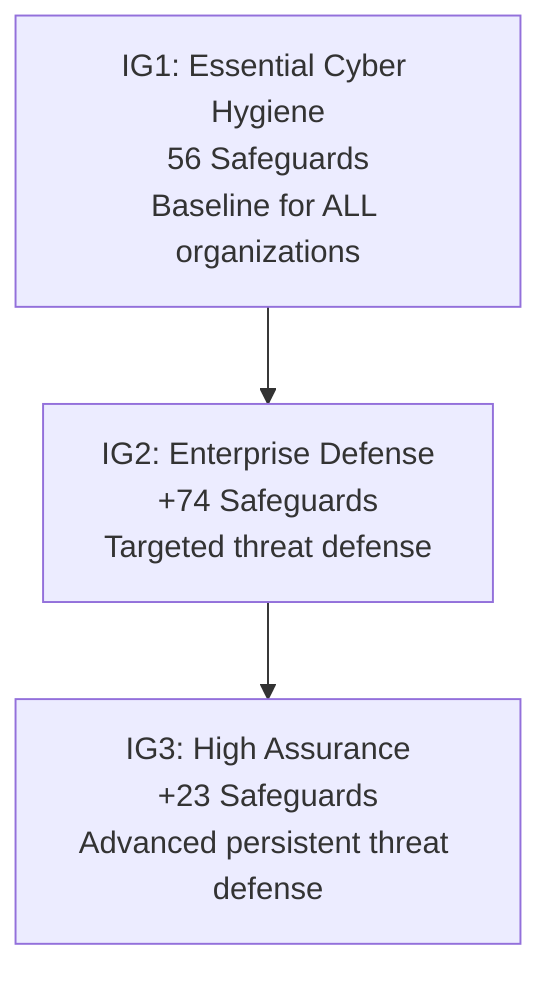

# CIS Critical Security Controls & Benchmarks

The **Center for Internet Security (CIS)** maintains two foundational resources in modern cybersecurity: the **CIS Critical Security Controls v8** (a prioritized set of 18 organizational actions to mitigate prevalent cyber attacks) and the **CIS Benchmarks** (prescriptive, consensus-derived technical configuration guides for hardening operating systems, cloud environments, and network hardware).

Compliance with CIS Level 1 benchmarks serves as the international baseline for standard cyber hygiene.

---

## CIS Critical Security Controls v8 Overview

The 18 CIS Controls organize 153 individual Safeguards prioritized into **Implementation Groups (IGs)**:

| Implementation Group | Target Organization Size | Operational Focus | Safeguards Covered |
|:---|:---|:---|:---:|
| **IG1 (Essential Cyber Hygiene)** | Small to medium enterprises with limited security expertise. | Foundational protections against untargeted, opportunistic attacks. | 56 Safeguards |
| **IG2 (Enterprise Defense)** | Mid-to-large organizations managing sensitive customer/business data. | Structured controls against targeted threats and regulatory requirements. | 74 Additional (130 Total) |
| **IG3 (High-Assurance Security)** | Large enterprises, critical infrastructure, defense contractors. | Advanced controls against sophisticated adversaries and zero-day exploits. | 23 Additional (153 Total) |



### The 18 CIS Controls v8 Taxonomy

| # | Control Name | Tactical Focus |
|:---:|:---|:---|
| **01** | **Inventory & Control of Enterprise Assets** | Actively manage, track, and correct all physical and virtual devices. |
| **02** | **Inventory & Control of Software Assets** | Track and permit only authorized software on enterprise workstations and servers. |
| **03** | **Data Protection** | Classify, encrypt, and manage data at rest and in transit. |
| **04** | **Secure Configuration of Assets & Software** | Establish and maintain hardened configuration baselines (CIS Benchmarks). |
| **05** | **Account Management** | Manage lifecycle of identities and credentials (disable stale accounts). |
| **06** | **Access Control Management** | Enforce least privilege, revoke dormant permissions, require MFA. |
| **07** | **Continuous Vulnerability Management** | Scan, prioritize, and remediate vulnerabilities across assets. |
| **08** | **Audit Log Management** | Collect, alert, review, and retain security event logs. |
| **09** | **Email & Web Browser Protections** | Filter phishing, enforce secure DNS, restrict unapproved browser plugins. |
| **10** | **Malware Defenses** | Deploy real-time antivirus, EDR, and anti-exploitation protections. |
| **11** | **Data Recovery** | Establish, encrypt, and regularly test automated backups. |
| **12** | **Network Infrastructure Management** | Harden firewalls, routers, switches, and gateways. |
| **13** | **Network Monitoring & Defense** | Centralize network flow telemetry, IDS/IPS, and perimeter anomaly detection. |
| **14** | **Security Awareness & Skills Training** | Educate workforce on social engineering, credential hygiene, and reporting. |
| **15** | **Service Provider Management** | Vet and monitor third-party cloud and SaaS vendors. |
| **16** | **Application Software Security** | Integrate SAST/DAST, parameterize SQL, sanitize inputs, enforce SDLC hygiene. |
| **17** | **Incident Response Management** | Maintain incident response plan, playbooks, communication channels, and drills. |
| **18** | **Penetration Testing** | Conduct simulated adversary exercises to validate security controls. |

---

## CIS Benchmarks Architecture: Profiles & STIG Comparison

CIS Benchmarks provide exact, step-by-step registry keys, configuration file paths, and terminal commands to harden systems:

| Profile / Standard | Usability Impact | Target Environment |
|:---|:---|:---|
| **CIS Level 1 Profile** | **Minimal to Low**. Can be implemented across enterprise fleets with negligible impact on business applications or user workflows. | Standard workstations, domain members, production web application servers. |
| **CIS Level 2 Profile** | **Medium to High**. Implements deep defense-in-depth (disables legacy protocols, restricts PowerShell execution, enforces restrictive firewalls). | Bastion hosts, jump boxes, air-gapped systems, Domain Controllers. |
| **DISA STIG** | **Very High**. Mandatory for US Department of Defense systems; frequently breaks commercial off-the-shelf software without extensive policy exemptions. | Military, defense industrial base, classified networks. |

---

## Practical Examples

### 1. PowerShell: Automated Windows CIS Level 1 Benchmark Audit

Audits critical account policies and registry hardening flags specified by the CIS Microsoft Windows Benchmark:

```powershell
function Invoke-WindowsCisAudit {
    [CmdletBinding()]
    param()

    $results = [System.Collections.Generic.List[PSCustomObject]]::new()

    # 1. CIS 1.1.1: Password Minimum Length >= 14 characters
    $secEditFile = Join-Path $env:TEMP "secedit_export.inf"
    secedit /export /cfg $secEditFile /areas SECURITYPOLICY | Out-Null
    $secContent = Get-Content $secEditFile -Raw
    Remove-Item $secEditFile -Force -ErrorAction SilentlyContinue

    $minPassLen = if ($secContent -match 'MinimumPasswordLength\s*=\s*(\d+)') { [int]$Matches[1] } else { 0 }
    $results.Add([PSCustomObject]@{
        BenchmarkItem = "CIS 1.1.1"
        Description   = "Minimum Password Length (>= 14)"
        CurrentValue  = $minPassLen
        Status        = if ($minPassLen -ge 14) { "PASS" } else { "FAIL" }
    })

    # 2. CIS 1.1.4: Account Lockout Threshold (<= 5 invalid attempts)
    $lockoutThreshold = if ($secContent -match 'LockoutBadCount\s*=\s*(\d+)') { [int]$Matches[1] } else { 0 }
    $results.Add([PSCustomObject]@{
        BenchmarkItem = "CIS 1.1.4"
        Description   = "Account Lockout Threshold (1-5 attempts)"
        CurrentValue  = $lockoutThreshold
        Status        = if ($lockoutThreshold -gt 0 -and $lockoutThreshold -le 5) { "PASS" } else { "FAIL" }
    })

    # 3. CIS 2.3.7.4: LanMan Authentication Level (Send NTLMv2 only, refuse LM & NTLM = 5)
    $lmRegPath = "HKLM:\SYSTEM\CurrentControlSet\Control\Lsa"
    $lmLevel = (Get-ItemProperty -Path $lmRegPath -Name "LmCompatibilityLevel" -ErrorAction SilentlyContinue).LmCompatibilityLevel
    $results.Add([PSCustomObject]@{
        BenchmarkItem = "CIS 2.3.7.4"
        Description   = "LM Compatibility Level (Must be 5: NTLMv2 only)"
        CurrentValue  = $lmLevel
        Status        = if ($lmLevel -eq 5) { "PASS" } else { "FAIL" }
    })

    # 4. CIS 2.3.1.5: Built-in Guest Account Disabled
    $guestUser = Get-LocalUser -Name "Guest" -ErrorAction SilentlyContinue
    $isGuestDisabled = $guestUser -and ($guestUser.Enabled -eq $false)
    $results.Add([PSCustomObject]@{
        BenchmarkItem = "CIS 2.3.1.5"
        Description   = "Built-in Guest Account Disabled"
        CurrentValue  = "Enabled=$($guestUser.Enabled)"
        Status        = if ($isGuestDisabled) { "PASS" } else { "FAIL" }
    })

    # 5. CIS 18.9.30.2: Remote Desktop NLA Enforced
    $rdpPath = "HKLM:\SYSTEM\CurrentControlSet\Control\Terminal Server\WinStations\RDP-Tcp"
    $nla = (Get-ItemProperty -Path $rdpPath -Name "UserAuthentication" -ErrorAction SilentlyContinue).UserAuthentication
    $results.Add([PSCustomObject]@{
        BenchmarkItem = "CIS 18.9.30.2"
        Description   = "RDP Network Level Authentication (NLA) Enforced (= 1)"
        CurrentValue  = $nla
        Status        = if ($nla -eq 1) { "PASS" } else { "FAIL" }
    })

    $results | Format-Table -AutoSize
}

# Example Execution:
# Invoke-WindowsCisAudit
```

---

### 2. Bash: Automated Linux CIS Level 1 Benchmark Audit

```bash
#!/usr/bin/env bash
# Audit critical CIS Linux Benchmark configurations

echo "=== CIS Linux Benchmark Level 1 Audit ==="

# 1. CIS 1.1.1: Verify /tmp is mounted on separate partition with nodev, nosuid, noexec
TMP_MOUNT=$(mount | grep -E '\s/tmp\s')
if [ -n "$TMP_MOUNT" ]; then
    echo "[CIS 1.1.1] /tmp Mount: Detected -> $TMP_MOUNT"
else
    echo "[CIS 1.1.1] /tmp Mount: FAIL (/tmp is not a separate mount)"
fi

# 2. CIS 5.4.4: Verify default umask is 027 or more restrictive
UMASK_VAL=$(umask)
echo "[CIS 5.4.4] Current Root umask: $UMASK_VAL (Recommended: 027)"

# 3. CIS 6.1.3: Verify permissions on /etc/shadow (0640 or 0000, root:shadow or root:root)
SHADOW_PERMS=$(stat -c "%a %U:%G" /etc/shadow)
if [[ "$SHADOW_PERMS" =~ ^(000|640|400)\ root:.* ]]; then
    echo "[CIS 6.1.3] /etc/shadow Permissions: PASS ($SHADOW_PERMS)"
else
    echo "[CIS 6.1.3] /etc/shadow Permissions: FAIL ($SHADOW_PERMS - Recommended: 0640 root:shadow)"
fi

# 4. CIS 5.2.2: Verify SSH Protocol version is strictly 2 and PermitEmptyPasswords is no
SSHD_EMPTY=$(sshd -T 2>/dev/null | grep -i "permitemptypasswords" || grep -Ei "^PermitEmptyPasswords" /etc/ssh/sshd_config)
echo "[CIS 5.2.2] SSH PermitEmptyPasswords: ${SSHD_EMPTY:-no}"
```

---

## Related References

- [NIST Cybersecurity Framework 2.0](nist-csf-2.md) — Strategic risk governance mapping to technical CIS controls.
- [Regulatory Frameworks & Cross-Walk](regulatory-frameworks.md) — Cross-referencing CIS Controls with SOC 2, ISO 27001, and PCI-DSS.
- [Windows Advanced Audit Policy & SACLs](../../platforms/windows/audit-policy.md) — Meeting CIS Control 08 requirements.
- [Linux Firewalls — nftables, iptables & UFW](../../platforms/linux/firewalls-nftables.md) — Meeting CIS Control 04 and 12 requirements.
