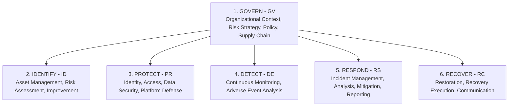

# NIST Cybersecurity Framework (CSF) 2.0

The **NIST Cybersecurity Framework (CSF) 2.0** (published February 2024) is the premier global standard for organizing, communicating, and improving cybersecurity risk management programs. CSF 2.0 expands beyond critical infrastructure to address all organizations of any size and sector, introducing the sixth foundational function: **Govern (GV)**.

Security engineers and SOC teams must understand how low-level technical controls—such as host hardening, EDR telemetry, SIEM detection rules, and incident playbooks—map directly to NIST CSF 2.0 categories.

---

## The CSF 2.0 Core Functions



### 1. GOVERN (GV) — The Strategic Umbrella
Establishes and monitors the organization's cybersecurity risk management strategy, expectations, and policy.
- **GV.OC (Organizational Context)**: Mission, stakeholders, and legal requirements understood.
- **GV.RM (Risk Management Strategy)**: Risk appetite, tolerance, and operational thresholds defined.
- **GV.RR (Roles, Responsibilities, and Authorities)**: Clear cybersecurity ownership established.
- **GV.PO (Policy)**: Organizational cybersecurity policies established, communicated, and enforced.
- **GV.OV (Oversight)**: Cybersecurity strategy results reviewed by executive leadership.
- **GV.SC (Cybersecurity Supply Chain Risk Management)**: Third-party vendor risks identified and managed.

### 2. IDENTIFY (ID)
Determines current cybersecurity risk to systems, people, assets, data, and capabilities.
- **ID.AM (Asset Management)**: Hardware, software, services, and data inventoried and prioritized.
- **ID.RA (Risk Assessment)**: Vulnerabilities, threats, impacts, and likelihoods calculated.
- **ID.IM (Improvement)**: Improvements identified from evaluations and operational feedback.

### 3. PROTECT (PR)
Applies safeguards to manage cybersecurity risks and protect critical assets.
- **PR.AA (Identity Management, Authentication, and Access Control)**: Enforce least privilege, MFA, and strong credential lifecycles.
- **PR.AT (Awareness and Training)**: Security training for personnel.
- **PR.DS (Data Security)**: Confidentiality, integrity, and availability of data protected at rest and in transit.
- **PR.PS (Platform Security)**: Hardware, software, and services managed through hardened configuration baselines and patch management.
- **PR.IR (Technology Infrastructure Resilience)**: Architecting resilience into network designs and microsegmentation.

### 4. DETECT (DE)
Discovers and analyzes cybersecurity attacks and anomalous compromises.
- **DE.CM (Continuous Monitoring)**: Assets monitored to find potential security events (EDR, SIEM, network telemetry).
- **DE.AE (Adverse Event Analysis)**: Anomalies analyzed to determine whether an incident has occurred.

### 5. RESPOND (RS)
Takes action regarding a detected cybersecurity incident.
- **RS.MA (Incident Management)**: Incident response procedures executed.
- **RS.AN (Incident Analysis)**: Root cause analysis and forensic triage performed.
- **RS.MI (Incident Mitigation)**: Containment actions executed (host isolation, credential revocation).
- **RS.CO (Incident Reporting and Communication)**: Stakeholders and regulatory bodies notified.

### 6. RECOVER (RC)
Restores assets and operations that were impacted by a cybersecurity incident.
- **RC.RP (Incident Recovery Plan Execution)**: Restoration activities performed from clean backups.
- **RC.CO (Recovery Communication)**: Internal and external communications executed post-recovery.

---

## Technical Control Operational Mapping

| NIST CSF 2.0 Subcategory | Operational Command & Code Implementation | Telemetry / Audit Artifact |
|:---|:---|:---|
| **PR.AA-01** (Identity Management) | [Conditional Access Policies](../../platforms/microsoft-365/conditional-access.md), [OAuth 2.0 & OIDC](../identity/oauth2.md) | Entra ID Sign-in logs, Kerberos Event ID 4768/4769 |
| **PR.AA-05** (Access Control / Least Privilege) | [Linux Users & Permissions](../../platforms/linux/users-permissions.md), [Windows Users & Groups](../../platforms/windows/users-groups.md) | Linux `sudoers` audit, Windows Local Administrator audits |
| **PR.DS-01** (Data-at-Rest Encryption) | [BitLocker Recovery Audit](../../tasks/administration/bitlocker-recovery.md), [Linux Storage & LVM](../../platforms/linux/storage-lvm.md) | `manage-bde -status`, `cryptsetup status` |
| **PR.DS-02** (Data-in-Transit Encryption) | [TLS Handshake & Ciphers](../networking/tls-ssl.md), [HTTP Security Headers](../web-apps/http-security-headers.md) | HSTS headers, SSL/TLS handshake certificates |
| **PR.PS-01** (Hardened Configurations) | [Windows WDAC & Exploit Guard](../../platforms/windows/wdac-exploit-guard.md), [Linux Firewalls](../../platforms/linux/firewalls-nftables.md) | CIS Benchmark audit scripts, AppLocker Event ID 8002 |
| **PR.PS-02** (Software Vulnerability Patching) | [System Maintenance & Updates](../../tasks/administration/system-maintenance-updates.md) | `Get-HotFix`, `apt update` / `dnf check-update` |
| **DE.CM-01** (Network & Host Telemetry) | [Sysmon Telemetry](../systems/sysmon.md), [Defender EDR](../../platforms/microsoft-365/defender.md) | Windows Event 1 (Process Create), 3 (Network Connect) |
| **DE.AE-02** (Adverse Event Correlation) | [Splunk Brute Force Detection](../../detection/spl/brute-force.md), [KQL Identity Hunting](../../detection/kql/logon-identity.md) | SIEM Correlation Alerts, MITRE ATT&CK T1110 |
| **RS.MI-01** (Containment & Mitigation) | [Ransomware Host Isolation](../../tasks/incident-response/ransomware-host-isolation.md), [Automated Containment](../../tasks/incident-response/automated-containment.md) | EDR Host Isolation API, Account Disabled Flag |
| **RC.RP-01** (Recovery Execution) | [Backup & Recovery Operations](../../tasks/administration/backup-and-recovery.md) | VSS Shadow Copies, Restored VM snapshots |

---

## Practical Examples

### 1. PowerShell: Host Compliance Audit Against NIST CSF 2.0 (PR.PS & PR.DS)

This script audits a local Windows host against core NIST CSF 2.0 technical safeguards:

```powershell
function Invoke-NistCsfHostAudit {
    [CmdletBinding()]
    param()

    $findings = [System.Collections.Generic.List[PSCustomObject]]::new()

    # 1. PR.DS-01: Data at Rest Encryption (BitLocker)
    $bitlocker = Get-BitLockerVolume -MountPoint "C:" -ErrorAction SilentlyContinue
    $isEncrypted = $bitlocker -and ($bitlocker.VolumeStatus -eq 'FullyEncrypted')
    $findings.Add([PSCustomObject]@{
        CsfFunction = "PROTECT (PR)"
        Category    = "PR.DS-01 (Data at Rest)"
        Control     = "C: Drive BitLocker Encryption"
        Status      = if ($isEncrypted) { "PASS" } else { "FAIL" }
        Details     = if ($bitlocker) { "Status: $($bitlocker.VolumeStatus)" } else { "BitLocker not configured" }
    })

    # 2. PR.PS-01: Platform Protection (Host Firewall)
    $firewallProfiles = Get-NetFirewallProfile -ErrorAction SilentlyContinue
    $allFwEnabled = ($firewallProfiles | Where-Object { $_.Enabled -eq $false }).Count -eq 0
    $findings.Add([PSCustomObject]@{
        CsfFunction = "PROTECT (PR)"
        Category    = "PR.PS-01 (Configuration)"
        Control     = "Windows Firewall All Profiles Active"
        Status      = if ($allFwEnabled) { "PASS" } else { "FAIL" }
        Details     = "Domain: $($firewallProfiles[0].Enabled), Private: $($firewallProfiles[1].Enabled), Public: $($firewallProfiles[2].Enabled)"
    })

    # 3. DE.CM-01: Continuous Monitoring (EDR / Defender Antivirus)
    $defender = Get-MpComputerStatus -ErrorAction SilentlyContinue
    $edrActive = $defender -and $defender.RealTimeProtectionEnabled -and $defender.AntivirusEnabled
    $findings.Add([PSCustomObject]@{
        CsfFunction = "DETECT (DE)"
        Category    = "DE.CM-01 (Host Monitoring)"
        Control     = "Real-Time Protection Engine Enabled"
        Status      = if ($edrActive) { "PASS" } else { "FAIL" }
        Details     = if ($defender) { "Signatures: $($defender.AntivirusSignatureVersion)" } else { "Defender not detected" }
    })

    # 4. PR.AA-01: Guest Account Disabled
    $guestUser = Get-LocalUser -Name "Guest" -ErrorAction SilentlyContinue
    $guestDisabled = $guestUser -and ($guestUser.Enabled -eq $false)
    $findings.Add([PSCustomObject]@{
        CsfFunction = "PROTECT (PR)"
        Category    = "PR.AA-01 (Identity & Access)"
        Control     = "Built-in Guest Account Disabled"
        Status      = if ($guestDisabled) { "PASS" } else { "FAIL" }
        Details     = "Guest Account Enabled: $($guestUser.Enabled)"
    })

    $findings | Format-Table -AutoSize
}

# Example Execution:
# Invoke-NistCsfHostAudit
```

---

### 2. Bash: Linux Host Safeguard Audit Against NIST CSF 2.0

```bash
#!/usr/bin/env bash
# Audit Linux host controls against NIST CSF 2.0 PR.PS and PR.AA

echo "=== NIST CSF 2.0 Linux Safeguards Audit ==="

# 1. PR.PS-01: Check UFW / nftables Host Firewall Status
if command -v ufw >/dev/null 2>&1; then
    UFW_STATUS=$(ufw status | head -n 1)
    echo "[PR.PS-01] Firewall Status: $UFW_STATUS"
elif command -v nft >/dev/null 2>&1; then
    NFT_RULES=$(nft list ruleset 2>/dev/null | wc -l)
    echo "[PR.PS-01] nftables rules loaded: $NFT_RULES lines"
fi

# 2. PR.AA-01: Check SSH Root Login Stance
SSH_ROOT=$(sshd -T 2>/dev/null | grep -i "permitrootlogin" || grep -Ei "^PermitRootLogin" /etc/ssh/sshd_config 2>/dev/null)
echo "[PR.AA-01] SSH Root Access: ${SSH_ROOT:-Not configured}"

# 3. DE.CM-01: Auditd Service State
if systemctl is-active auditd >/dev/null 2>&1; then
    echo "[DE.CM-01] auditd Security Telemetry: PASS (Active)"
else
    echo "[DE.CM-01] auditd Security Telemetry: FAIL (Inactive)"
fi

# 4. PR.DS-01: Check LUKS Disk Encryption
LUKS_VOLS=$(lsblk -f | grep -i "crypto_LUKS" | wc -l)
if [ "$LUKS_VOLS" -gt 0 ]; then
    echo "[PR.DS-01] Encrypted Volumes (LUKS): PASS ($LUKS_VOLS volume(s) detected)"
else
    echo "[PR.DS-01] Encrypted Volumes (LUKS): WARNING (No LUKS volumes identified)"
fi
```

---

## Related References

- [CIS Benchmarks & Critical Controls](cis-benchmarks.md) — Tactical benchmarks and Implementation Groups.
- [Regulatory Frameworks & Cross-Walk](regulatory-frameworks.md) — Mapping NIST CSF 2.0 to ISO 27001, SOC 2, and PCI-DSS.
- [Windows Advanced Audit Policy](../../platforms/windows/audit-policy.md) — Configuring audit telemetry for DE.CM.
- [Automated Containment Workflow](../../tasks/incident-response/automated-containment.md) — Operational execution of Respond (RS.MI).
