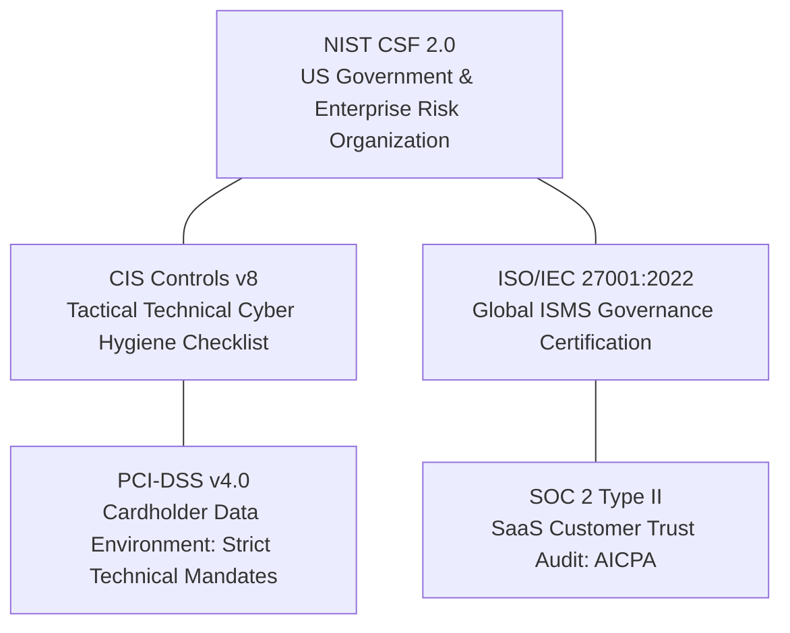

# Regulatory Compliance & Framework Cross-Walk

Enterprise organizations rarely operate under a single security standard. Instead, security teams must satisfy multiple overlapping regulatory regimes and customer assurance requirements simultaneously.

Engineering technical controls once and mapping them across multiple frameworks—known as the **"Test Once, Comply Many"** model—is the hallmark of a mature Governance, Risk, and Compliance (GRC) program.

---

## The Master Framework Cross-Walk Matrix

This cross-walk bridges high-level policy frameworks (**NIST CSF 2.0**, **ISO 27001**) with tactical audit controls (**CIS Controls v8**, **PCI-DSS v4.0**, and **SOC 2**):

| Control Domain | NIST CSF 2.0 | CIS Controls v8 | ISO/IEC 27001:2022 | SOC 2 (TSC) | PCI-DSS v4.0 |
|:---|:---|:---|:---|:---|:---|
| **Asset Inventory** | ID.AM-01 / 02 | Control 01 & 02 | A.5.9 / A.5.10 | CC6.1 / CC6.2 | Req 2.4 / 9.1 |
| **Least Privilege & RBAC** | PR.AA-01 / 05 | Control 05 & 06 | A.5.15 / A.8.2 | CC6.1 / CC6.3 | Req 7.1 / 7.2 |
| **Multi-Factor Auth (MFA)** | PR.AA-03 | Control 06.3 / 06.4 | A.8.5 | CC6.1 | Req 8.3 / 8.4 |
| **Data Encryption at Rest** | PR.DS-01 | Control 03.11 | A.8.24 | CC6.1 / CC6.7 | Req 3.4 / 3.5 |
| **Data Encryption in Transit** | PR.DS-02 | Control 03.10 | A.8.24 | CC6.6 / CC6.7 | Req 4.1 / 4.2 |
| **Patch & Vulnerability Mgmt** | PR.PS-02 / ID.RA | Control 07 | A.8.8 | CC7.1 / CC7.2 | Req 6.2 / 6.3 |
| **Audit Logging & Retention** | DE.CM-01 / 03 | Control 08 | A.8.15 | CC7.2 / CC7.3 | Req 10.1 / 10.5 |
| **Continuous EDR / Anti-Malware**| DE.CM-01 | Control 10 | A.8.7 | CC6.8 | Req 5.1 / 5.2 |
| **Network Segmentation & FW** | PR.IR-01 / PR.PS | Control 04 & 12 | A.8.20 / A.8.21 | CC6.6 | Req 1.1 / 1.3 |
| **Incident Response & Playbooks**| RS.MA-01 / RS.AN | Control 17 | A.5.24 - A.5.28 | CC7.3 / CC7.4 | Req 12.10 |
| **Backup & Disaster Recovery** | RC.RP-01 / PR.IR | Control 11 | A.8.13 | CC9.1 | Req 9.5 / 12.10 |
| **Vendor & Supply Chain Risk** | GV.SC-01 - 07 | Control 15 | A.5.19 - A.5.22 | CC9.2 | Req 12.8 |

---

## Framework Profiles at a Glance



### 1. ISO/IEC 27001:2022
- **Structure**: Clauses 4–10 (Management System requirements) and **Annex A** (93 Controls grouped into 4 themes: Organizational, People, Physical, and Technological).
- **Core Goal**: Formally certify that an organization maintains an operational **Information Security Management System (ISMS)**.

### 2. SOC 2 Type II (AICPA)
- **Trust Services Criteria (TSC)**: Security (Common Criteria CC1–CC9, mandatory), Availability, Processing Integrity, Confidentiality, Privacy.
- **Type I vs Type II**: Type I evaluates control design at a single point in time; **Type II** evaluates operating effectiveness over a minimum 6-month observation window.

### 3. PCI-DSS v4.0
- **Scope**: Any system component that stores, processes, or transmits Cardholder Data (CHD) or Sensitive Authentication Data (SAD).
- **Enforcement**: Zero-tolerance mandatory requirements; annual QSA audits or Self-Assessment Questionnaires (SAQ).

---

## Practical Examples: Automated Audit Evidence Collection

When external auditors perform compliance reviews, they require timestamped, unalterable configuration evidence from production hosts.

### 1. PowerShell: Automated Compliance Evidence Collector

Generates a structured, timestamped evidence bundle of system configuration, password policies, and encryption status:

```powershell
function Export-ComplianceEvidenceBundle {
    [CmdletBinding()]
    param(
        [Parameter(Mandatory = $false)]
        [string]$OutputDirectory = ".\ComplianceEvidence"
    )

    if (-not (Test-Path $OutputDirectory)) {
        New-Item -ItemType Directory -Path $OutputDirectory -Force | Out-Null
    }

    $timestamp = (Get-Date).ToString("yyyyMMdd_HHmmss")
    $computerName = $env:COMPUTERNAME

    Write-Host "Collecting compliance evidence for $computerName..." -ForegroundColor Cyan

    $evidence = [ordered]@{
        Metadata = @{
            HostName       = $computerName
            CollectionTime = (Get-Date).ToString("o")
            OSVersion      = (Get-CimInstance Win32_OperatingSystem).Caption
            Domain         = (Get-CimInstance Win32_ComputerSystem).Domain
        }
        
        # 1. Antivirus & EDR Status (SOC 2 CC6.8, PCI-DSS Req 5)
        SecuritySoftware = (Get-MpComputerStatus | Select-Object AntivirusEnabled, RealTimeProtectionEnabled, AntivirusSignatureVersion)

        # 2. Local Administrators Inventory (SOC 2 CC6.3, ISO A.5.15)
        LocalAdministrators = (Get-LocalGroupMember -Group "Administrators" | Select-Object Name, ObjectClass, PrincipalSource)

        # 3. Disk Encryption (PCI-DSS Req 3.4, ISO A.8.24)
        BitLockerStatus = (Get-BitLockerVolume | Select-Object MountPoint, VolumeStatus, EncryptionMethod, ProtectionStatus)

        # 4. Host Firewall Profiles (PCI-DSS Req 1, CIS Control 04)
        FirewallProfiles = (Get-NetFirewallProfile | Select-Object Name, Enabled, DefaultInboundAction, DefaultOutboundAction)

        # 5. Installed Updates (NIST PR.PS-02, ISO A.8.8)
        RecentPatches = (Get-HotFix | Sort-Object InstalledOn -Descending | Select-Object -First 10 HotFixID, Description, InstalledOn)
    }

    # Save structured evidence JSON
    $jsonPath = Join-Path $OutputDirectory "Evidence_${computerName}_${timestamp}.json"
    $evidence | ConvertTo-Json -Depth 6 | Out-File -FilePath $jsonPath -Encoding utf8

    Write-Host "Evidence bundle saved to: $jsonPath" -ForegroundColor Green
    return $jsonPath
}

# Example Usage:
# Export-ComplianceEvidenceBundle
```

---

### 2. Bash: Linux Compliance Evidence Collector

```bash
#!/usr/bin/env bash
# Collects audit evidence for ISO 27001, SOC 2, and PCI-DSS reviews

OUTPUT_DIR="./compliance_evidence_$(date +%Y%m%d_%H%M%S)"
mkdir -p "$OUTPUT_DIR"

echo "=== Collecting Linux Compliance Evidence to $OUTPUT_DIR ==="

# 1. OS & Kernel Baseline
uname -a > "$OUTPUT_DIR/os_kernel.txt"
cat /etc/os-release >> "$OUTPUT_DIR/os_kernel.txt"

# 2. Sudoers & Root Privileges (ISO A.5.15 / SOC 2 CC6.3)
grep -E -v '^(#|$)' /etc/sudoers /etc/sudoers.d/* 2>/dev/null > "$OUTPUT_DIR/sudoers_configuration.txt"

# 3. Listening Network Sockets (PCI-DSS Req 1 / CIS Control 12)
ss -tulpn > "$OUTPUT_DIR/open_ports_and_services.txt"

# 4. SSH Daemon Configuration (CIS Control 04 / NIST PR.AC)
sshd -T 2>/dev/null > "$OUTPUT_DIR/sshd_active_configuration.txt"

# 5. Installed Package Verification (ISO A.8.8)
if command -v dpkg >/dev/null 2>&1; then
    dpkg -l > "$OUTPUT_DIR/installed_packages.txt"
elif command -v rpm >/dev/null 2>&1; then
    rpm -qa > "$OUTPUT_DIR/installed_packages.txt"
fi

echo "Collection complete. Evidence stored in $OUTPUT_DIR"
```

---

## Related References

- [NIST Cybersecurity Framework 2.0](nist-csf-2.md) — Strategic CSF 2.0 functions (Govern through Recover).
- [CIS Critical Security Controls & Benchmarks](cis-benchmarks.md) — Tactical benchmarks and Implementation Groups.
- [Active Directory STIG Compliance](../../tasks/assurance/ad-stig-compliance.md) — DoD STIG compliance automation.
- [Azure Network Security Group Compliance](../../tasks/assurance/azure-nsg-compliance.md) — Cloud network posture assurance.
