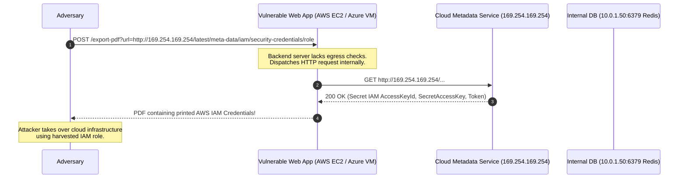

# Server-Side Request Forgery (SSRF) & Egress Defense

**Server-Side Request Forgery (SSRF)** occurs when a web application accepts a user-supplied URL and fetches data from that resource using the backend server's network stack without adequate destination validation. 

Because backend servers frequently sit behind corporate firewalls or inside cloud VPCs with implicit trust, an attacker exploiting SSRF can reach internal microservices, query link-local cloud metadata endpoints (`169.254.169.254`) to steal IAM credentials, or scan internal RFC 1918 subnets.

---

## SSRF Attack Anatomy & Cloud Metadata Targets



### Critical Internal Target Endpoints

| Target / Provider | Target URI | Harvested Secret / Impact |
|:---|:---|:---|
| **AWS IMDSv1** | `http://169.254.169.254/latest/meta-data/iam/security-credentials/{role-name}` | Temporary IAM STS security credentials; allows full AWS API pivoting. |
| **Azure Instance Metadata** | `http://169.254.169.254/metadata/identity/oauth2/token?api-version=2018-02-01&resource=https://management.azure.com/` | Managed Identity OAuth access token; permits Azure Resource Manager control. |
| **Google Cloud (GCP)** | `http://metadata.google.internal/computeMetadata/v1/instance/service-accounts/default/token` | Service account access token (requires `Metadata-Flavor: Google` header). |
| **Docker Daemon** | `http://127.0.0.1:2375/containers/json` | Container breakout and host container orchestration control. |
| **Internal Redis / Memcached** | `http://127.0.0.1:6379/` or `http://10.0.1.50:6379/` | In-memory cache manipulation or command execution via Gopher/HTTP pipelining. |

---

## Bypassing Naive SSRF Filters

Attackers routinely bypass simple blacklist filters that only check for the string `"127.0.0.1"` or `"localhost"`:

1. **Alternative IP Encodings**:
   - Dotted Hex: `http://0x7f.0x0.0x0.1/` (evaluates to `127.0.0.1`)
   - Integer / Dword: `http://2130706433/` (evaluates to `127.0.0.1`)
   - Dword for `169.254.169.254`: `http://2852039166/`
   - IPv6 Localhost: `http://[::1]/`
   - IPv4-mapped IPv6: `http://[::ffff:169.254.169.254]/`
2. **DNS Rebinding**:
   - The attacker registers a domain (`rebind.attacker.com`) configured with a short TTL (1 second).
   - On the first lookup during application URL validation, the DNS server returns an external public IP (`203.0.113.5`).
   - Milliseconds later when the backend HTTP client executes the actual fetch, the DNS server returns `169.254.169.254` or `127.0.0.1`.
3. **HTTP 301/302 Redirect Chains**:
   - The user provides an innocent external URL (`https://attacker.com/image.png`).
   - When requested by the server, it issues `302 Found` with `Location: http://169.254.169.254/latest/meta-data/`.

---

## Defensive Engineering: Production SSRF Mitigations

### 1. Require IMDSv2 (Session-Oriented Metadata)
In AWS, transition all instances from IMDSv1 to **IMDSv2**. IMDSv2 requires a `PUT` request with a special header (`X-aws-ec2-metadata-token-ttl-seconds: 21600`) to retrieve a session token, and uses that token in subsequent `GET` requests. Because simple SSRF bugs can rarely perform multi-step HTTP token retrieval, IMDSv2 neutralizes most cloud metadata theft.

### 2. Network-Level Egress Filtering
Enforce firewall / NSG rules on application servers:
- **Block Outbound Egress** to `169.254.169.254/32`.
- **Block Outbound Egress** to private subnets (`10.0.0.0/8`, `172.16.0.0/12`, `192.168.0.0/16`, `127.0.0.0/8`).

---

## Practical Examples

### 1. Python: Robust SSRF-Safe Request Validator

To defeat DNS rebinding and IP obfuscation, resolve the hostname to an IP address first, validate the IP against all private/link-local CIDR ranges, and bind the connection directly to the verified IP:

```python
import ipaddress
import socket
import urllib.parse
from typing import Tuple
import requests

BLOCKED_NETWORKS = [
    ipaddress.ip_network("0.0.0.0/8"),
    ipaddress.ip_network("10.0.0.0/8"),
    ipaddress.ip_network("100.64.0.0/10"),
    ipaddress.ip_network("127.0.0.0/8"),
    ipaddress.ip_network("169.254.0.0/16"),       # Link-local & Cloud Metadata
    ipaddress.ip_network("172.16.0.0/12"),
    ipaddress.ip_network("192.168.0.0/16"),
    ipaddress.ip_network("224.0.0.0/4"),         # Multicast
    ipaddress.ip_network("240.0.0.0/4"),
    ipaddress.ip_network("::1/128"),             # IPv6 Loopback
    ipaddress.ip_network("fe80::/10"),           # IPv6 Link-local
    ipaddress.ip_network("fc00::/7"),            # IPv6 Unique Local
]

def validate_url_safe_for_ssrf(target_url: str) -> Tuple[bool, str]:
    """Validates that a URL does not resolve to private, loopback, or metadata addresses."""
    parsed = urllib.parse.urlparse(target_url)
    
    # 1. Enforce HTTPS or HTTP scheme only
    if parsed.scheme not in ("http", "https"):
        return False, f"Disallowed scheme: {parsed.scheme}"

    hostname = parsed.hostname
    if not hostname:
        return False, "Missing hostname"

    try:
        # 2. Resolve DNS to IP addresses
        addr_info = socket.getaddrinfo(hostname, None)
        resolved_ips = set(info[4][0] for info in addr_info)

        # 3. Check every resolved IP against blocked CIDRs
        for ip_str in resolved_ips:
            ip_obj = ipaddress.ip_address(ip_str)
            for blocked_net in BLOCKED_NETWORKS:
                if ip_obj in blocked_net:
                    return False, f"Blocked target IP: {ip_str} falls within {blocked_net}"

        return True, "URL is safe for egress"

    except socket.gaierror:
        return False, "Failed to resolve hostname"
```

---

### 2. PowerShell: Auditing AWS & Azure Host Metadata Protection

```powershell
function Test-CloudMetadataHardening {
    [CmdletBinding()]
    param()

    # Test Azure / AWS Link-Local metadata accessibility from current machine
    $metadataUri = "http://169.254.169.254"

    try {
        Write-Verbose "Probing reachability of link-local metadata at $metadataUri..."
        $testConn = Test-NetConnection -ComputerName "169.254.169.254" -Port 80 -WarningAction SilentlyContinue -InformationLevel Quiet
        
        if ($testConn) {
            Write-Warning "CRITICAL: Link-local metadata service (169.254.169.254:80) is NETWORK REACHABLE from this host!"
            Write-Warning "Ensure IMDSv2 is enforced or host firewall blocks outbound port 80 to 169.254.169.254."
        }
        else {
            Write-Host "PASS: Link-local metadata port 80 is not reachable." -ForegroundColor Green
        }
    }
    catch {
        Write-Host "PASS: Transport blocked to link-local metadata." -ForegroundColor Green
    }
}
```

---

## Related References

- [OWASP Top 10 for Web Applications](owasp-web-top-10.md) — Category breakdown including A10: Server-Side Request Forgery.
- [API Security & Error Handling](../apis/security-error-handling.md) — OWASP API7 SSRF considerations.
- [Azure Virtual Network (VNet) Security](../cloud/azure-vnet-security.md) — Restricting cloud egress traffic using NSGs.
- [NIST Cybersecurity Framework 2.0](../grc/nist-csf-2.md) — Network segmentation and platform protection (PR.PT).
