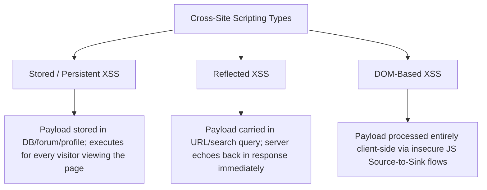

# Cross-Site Scripting (XSS) & Content Security Policy

**Cross-Site Scripting (XSS)** is a client-side code injection vulnerability that occurs when a web application includes untrusted user data in a rendered web page without adequate validation or context-aware encoding. This allows an attacker to execute arbitrary JavaScript in the victim's browser within the security context of the vulnerable origin.

XSS enables session hijacking (stealing session cookies), keylogging, credential harvesting via fraudulent login prompts, and executing unauthorized actions on behalf of authenticated users.

---

## The Three Primary Types of XSS



| Type | Persistence | Execution Flow | Common Injection Points |
|:---|:---|:---|:---|
| **Stored (Persistent)** | Database, File, Comment Log | Victim browses to a page where malicious script is retrieved from database and rendered into HTML. | User profile bio, customer feedback forms, forum comments, ticket notes. |
| **Reflected** | Non-persistent (URL / Request) | Attacker tricks victim into clicking a link (`https://app.com/search?q=<script>...`); server reflects query directly into response HTML. | Search query results, error messages, form repopulation on validation error. |
| **DOM-based** | Client-side only | The payload never touches the server. Client-side JavaScript reads from a *source* (`window.location`) and writes to an unsafe *sink* (`element.innerHTML`). | Client-side routing, single-page application hash navigation, dynamic widget rendering. |

---

## DOM Sources and Sinks

In modern Single Page Applications (React, Vue, Angular, Vanilla JS), DOM XSS occurs when data flows from an untrusted **Source** into an executable **Sink**:

| Category | Examples |
|:---|:---|
| **Dangerous Sources** | `location.search`, `location.hash`, `document.referrer`, `window.name`, `postMessage` event data. |
| **Execution Sinks (Unsafe)** | `element.innerHTML`, `document.write()`, `eval()`, `setTimeout(string)`, `scriptElement.src`. |
| **Safe Alternatives** | `element.textContent`, `element.setAttribute('data-...', val)`, `JSON.parse()`. |

---

## Defensive Engineering

### 1. Context-Aware Output Encoding
Encoding must match the specific context where user data is inserted into the document:

| Context | Example Location | Required Encoding / Escaping |
|:---|:---|:---|
| **HTML Body** | `<div>{{ userInput }}</div>` | Convert `&`, `<`, `>`, `"`, `'` to HTML entities (`&amp;`, `&lt;`, `&gt;`, `&quot;`, `&#x27;`). |
| **HTML Attribute** | `<input value="{{ userInput }}"/>` | Strict attribute encoding; always wrap attributes in quotes. |
| **JavaScript Variable** | `<script>let x = "{{ userInput }}";</script>` | Unicode escaping (`\u003C`) or serialize with `json.dumps()` / `JSON.stringify()`. |
| **URL Parameter** | `<a href="/profile?id={{ userInput }}">` | URL encoding (`encodeURIComponent()`). Ensure scheme is restricted to `http:` or `https:`; block `javascript:`. |

### 2. Cookie Security: The `HttpOnly` Defense
Always mark authentication and session cookies with the **`HttpOnly`** flag. This instructs the browser that the cookie cannot be read via `document.cookie` in JavaScript, mitigating cookie theft even if an XSS vulnerability exists on the page.

### 3. Content Security Policy (CSP)
A robust **Content Security Policy** header instructs modern browsers which domains and script sources are permitted to load and execute.

---

## Practical Examples

### 1. Hardened Content Security Policy (CSP) Header

A strict modern CSP using cryptographic nonces or hashes completely neutralizes inline script injection:

```http
Content-Security-Policy: default-src 'self'; script-src 'self' 'nonce-rAnd0m123456' https://trusted-cdn.com; style-src 'self' 'unsafe-inline'; object-src 'none'; base-uri 'self'; form-action 'self'; frame-ancestors 'none';
```

#### Directive Breakdown
- `default-src 'self'`: Restricts all unspecified resource types (images, media, fonts) to the origin domain.
- `script-src 'self' 'nonce-...'`: Only executes scripts matching the dynamic per-request cryptographic nonce. Blocks arbitrary inline `<script>` tags injected by attackers.
- `object-src 'none'`: Disables Flash, Java applets, and legacy plugin execution.
- `frame-ancestors 'none'`: Prevents clickjacking by forbidding any domain (including self) from embedding the site in an `<iframe>`.

---

### 2. Python: Safe Context Rendering in Web Frameworks

```python
import html
import json
from fastapi import FastAPI, Response
from fastapi.responses import HTMLResponse

app = FastAPI()

@app.get("/search", response_class=HTMLResponse)
async def safe_search(query: str = ""):
    # SECURE: HTML entity encode user query before inserting into HTML body
    safe_query = html.escape(query, quote=True)
    
    # Generate cryptographic per-request nonce for inline scripts
    nonce = "v4l1dN0nc3Str1ng987"

    html_content = f"""
    <!DOCTYPE html>
    <html>
    <head>
        <title>Search Results</title>
    </head>
    <body>
        <h1>Search Results for: {safe_query}</h1>
        <div id="results">No items found.</div>
        
        <!-- Only scripts with the exact matching nonce will execute -->
        <script nonce="{nonce}">
            console.log("Legitimate application script executed.");
        </script>
    </body>
    </html>
    """
    
    response = HTMLResponse(content=html_content)
    # Apply strict CSP header
    response.headers["Content-Security-Policy"] = (
        f"default-src 'self'; script-src 'self' 'nonce-{nonce}'; object-src 'none';"
    )
    return response
```

---

### 3. PowerShell: Auditing Web Endpoints for Missing CSP & Cookie Security

```powershell
function Test-WebEndpointSecurityHeaders {
    [CmdletBinding()]
    param(
        [Parameter(Mandatory = $true)]
        [Uri]$Uri
    )

    try {
        $response = Invoke-WebRequest -Uri $Uri -Method Head -TimeoutSec 15
        $headers = $response.Headers

        $csp = if ($headers.Contains('Content-Security-Policy')) { $headers['Content-Security-Policy'][0] } else { $null }
        $cookies = if ($headers.Contains('Set-Cookie')) { $headers['Set-Cookie'] } else { @() }

        $hasHttpOnly = $false
        $hasSecure = $false
        foreach ($cookie in $cookies) {
            if ($cookie -match '(?i)\bHttpOnly\b') { $hasHttpOnly = $true }
            if ($cookie -match '(?i)\bSecure\b') { $hasSecure = $true }
        }

        [PSCustomObject]@{
            TargetUri         = $Uri.ToString()
            HasCSP            = [bool]$csp
            CSPDirectiveCount = if ($csp) { ($csp -split ';').Count } else { 0 }
            HasHttpOnlyCookie = $hasHttpOnly
            HasSecureCookie   = $hasSecure
            Status            = [int]$response.StatusCode
        }
    }
    catch {
        Write-Error "Failed to probe endpoint: $_"
    }
}

# Example Usage:
# Test-WebEndpointSecurityHeaders -Uri "https://portal.contoso.com" | Format-List
```

---

## Related References

- [OWASP Top 10 for Web Applications](owasp-web-top-10.md) — Category breakdown including A03: Injection.
- [HTTP Security Headers](http-security-headers.md) — Production header baselines for NGINX, Apache, and IIS.
- [Session Management & Cookie Security](session-management.md) — Cookie flags (`Secure`, `HttpOnly`, `SameSite`) and token rotation.
- [NIST Cybersecurity Framework 2.0](../grc/nist-csf-2.md) — Mapping web controls to Protect (PR.PS) and Detect (DE.CM).
