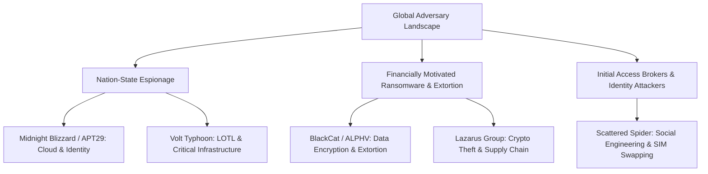

# Threat Actor Intelligence Profiles & TTP Reference Cards

This reference matrix provides structured tactical profiles of prevalent adversary groups, detailing their preferred initial access vectors, tooling, infrastructure patterns, and high-fidelity detection artifacts.

---

## 1. Adversary Landscape Overview



---

## 2. Threat Actor Reference Cards

### Profile 1: Midnight Blizzard (APT29 / Cozy Bear / Nobelium)

* **Origin & Motivation:** Russian Foreign Intelligence (SVR) · Strategic Cyber Espionage.
* **Target Sectors:** Government, Think Tanks, Defense Industrial Base, IT & Cloud Service Providers.
* **Primary Initial Access:** Stolen credentials via password spraying, compromised OAuth applications, supply chain infiltration.

| Domain | Adversary Tradecraft | ATT&CK ID | Key Telemetry Artifacts |
| :--- | :--- | :--- | :--- |
| **Identity & Cloud** | Malicious OAuth App Registrations, bypassing MFA via dormant test tenant accounts. | T1098.003, T1078.004 | Entra ID `AuditLogs`: `Consent to application`, `Add service principal credentials`. |
| **Execution** | Living off the cloud, Microsoft Graph API queries, PowerShell unmanaged runspaces. | T1059.001, T1106 | Graph API sign-ins from residential IP pools without interactive browser fingerprints. |
| **Defense Evasion** | Disabling cloud audit settings, using trusted infrastructure proxies to evade geolocation alerts. | T1562.008, T1090 | Atypical sign-ins where ASN matches commercial consumer ISP rather than corporate VPN. |

---

### Profile 2: Volt Typhoon (Vanguard Panda / Bronze Silhouette)

* **Origin & Motivation:** People's Republic of China (PRC) · Pre-positioning for Disruptive Cyber Attacks against Critical Infrastructure.
* **Target Sectors:** Telecommunications, Energy, Transportation, Maritime, Water Systems.
* **Primary Initial Access:** Exploitation of edge appliances (Fortinet, Ivanti, SonicWall, Cisco) and compromised SOHO routers (KV-botnet).

| Domain | Adversary Tradecraft | ATT&CK ID | Key Telemetry Artifacts |
| :--- | :--- | :--- | :--- |
| **Endpoint Execution** | Exclusively Living-off-the-Land (LOTL): `wmic`, `powershell`, `netsh`, `ping`, `tracert`. Zero custom binaries. | T1047, T1059.003, T1016 | Bursts of rapid network enumeration commands (`netsh interface portproxy`, `ping -n 1`). |
| **Persistence** | Port forwarding via `netsh interface portproxy`, web shells placed in existing IIS/Apache roots. | T1090.001, T1505.003 | Registry key: `HKLM\SYSTEM\CurrentControlSet\Services\PortProxy\v4tov4\tcp`. |
| **Credential Access** | Extracting NTDS.dit via `ntdsutil` or Volume Shadow Copies without third-party tools. | T1003.003, T1490 | Command line: `ntdsutil "ac i ntds" "ifm" "create full C:\..."`. |

---

### Profile 3: Scattered Spider (UNC3944 / Octo Tempest / Muddled Libra)

* **Origin & Motivation:** Native English-Speaking Cybercrime Coalition · Extortion, Ransomware Affiliation.
* **Target Sectors:** Telecommunications, BPO/Call Centers, Hospitality, Retail, Financial Services.
* **Primary Initial Access:** Sophisticated voice phishing (vishing) targeting IT Help Desks, SMS phishing, SIM swapping.

| Domain | Adversary Tradecraft | ATT&CK ID | Key Telemetry Artifacts |
| :--- | :--- | :--- | :--- |
| **Identity Hijacking** | Requesting MFA token resets via IT Help Desk impersonation, registering rogue FIDO2/authenticator devices. | T1556, T1098.005 | Okta / Entra ID logs: MFA device reset followed immediately by sign-in from a new device/IP. |
| **Defense Evasion** | Deploying Bring-Your-Own-Vulnerable-Driver (BYOVD) to terminate EDR sensors (`mhyprot2.sys`, `procexp.sys`). | T1562.001, T1068 | Windows System Event ID 7045 registering known vulnerable kernel drivers. |
| **Lateral Movement** | Remote Desktop Protocol (RDP), Fleet management tools (AnyDesk, TeamViewer, Splashtop). | T1021.001, T1219 | Rapid RDP connections across workstations using newly provisioned Help Desk administrative accounts. |

---

### Profile 4: BlackCat / ALPHV

* **Origin & Motivation:** Russian-speaking Ransomware-as-a-Service (RaaS) · Financial Extortion.
* **Target Sectors:** Healthcare, Manufacturing, Professional Services, Public Sector.
* **Primary Initial Access:** Purchased credentials from Initial Access Brokers (IABs), VPN/VDI credential stuffing.

| Domain | Adversary Tradecraft | ATT&CK ID | Key Telemetry Artifacts |
| :--- | :--- | :--- | :--- |
| **Discovery & Staging** | Active Directory reconnaissance using AdFind and BloodHound; exfiltration via MegaSync or Rclone. | T1087.002, T1567.002 | Process execution: `adfind.exe -f "(objectcategory=person)"`, `rclone.exe copy`. |
| **Impact** | Rust-based encryptor disabling shadow copies, terminating Hyper-V/ESXi VMs, wiping backups. | T1486, T1490, T1529 | Command execution: `vssadmin.exe delete shadows /all /quiet`, ESXi `esxcli vm process kill`. |

---

## 3. High-Fidelity Cross-Actor Hunting Query

### Microsoft Defender XDR (KQL): Multi-Actor LOTL Reconnaissance Burst

```kql
// Detect anomalous bursts of reconnaissance commands characteristic of Volt Typhoon and IABs
let Window = 5m;
let ReconTools = dynamic(["net.exe", "net1.exe", "whoami.exe", "nltest.exe", "tracert.exe", "netsh.exe", "route.exe"]);
DeviceProcessEvents
| where TimeGenerated >= ago(24h)
| where FileName in~ (ReconTools)
| project TimeGenerated, DeviceName, InitiatingProcessFileName, FileName, ProcessCommandLine, AccountName
| summarize 
    CommandCount = count(),
    UniqueTools = dcount(FileName),
    ToolList = make_set(FileName),
    Commands = make_set(ProcessCommandLine, 5)
    by DeviceName, AccountName, bin(TimeGenerated, Window)
| where UniqueTools >= 3 and CommandCount >= 5
| sort by CommandCount desc
```
