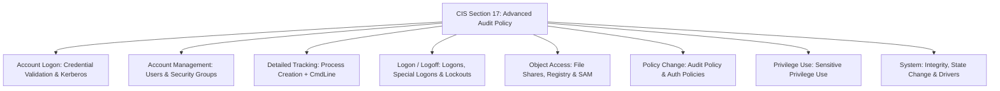

# Windows CIS Benchmark — Advanced Audit Policy Baseline

Legacy Windows Audit Policies operated at broad categorical levels (e.g., "Audit Logon Events"), flooding the Security Event Log with benign noise while missing granular attacker actions. **CIS Section 17 (Advanced Audit Policy Configuration)** enforces subcategory-level auditing, capturing the exact security events needed for threat detection, incident response, and regulatory compliance (NIST CSF `DE.CM-01`, PCI DSS 10.2).

---

## 1. Advanced Audit Policy Taxonomy & CIS Standards

The CIS Benchmark mandates specific subcategory settings across the 9 core audit categories:



### CIS Section 17 Subcategory Matrix

| CIS ID | Audit Subcategory | Recommended Setting | Primary Event IDs | Detection Utility |
| :--- | :--- | :--- | :--- | :--- |
| **17.1.1** | Credential Validation | Success & Failure | 4776 | NTLM authentication validation & brute-force |
| **17.1.2** | Kerberos Authentication Service | Success & Failure | 4768, 4771 | AS-REP Roasting & Kerberos pre-authentication failure |
| **17.1.3** | Kerberos Service Ticket Operations | Success & Failure | 4769 | Kerberoasting detection |
| **17.2.1** | Computer Account Management | Success | 4741, 4742 | Machine account creation / silver ticket creation |
| **17.2.5** | Security Group Management | Success | 4728, 4732, 4756 | Privilege escalation to Domain/Local Admins |
| **17.2.6** | User Account Management | Success & Failure | 4720, 4722, 4724 | Unauthorized account creation & password resets |
| **17.3.1** | Process Creation | Success | 4688 | Execution, LOLBins, attacker command-line activity |
| **17.5.1** | Account Lockout | Success | 4740 | Brute-force lockout alerting |
| **17.5.2** | Group Membership | Success | 4627 | Dynamic group membership at logon time |
| **17.5.4** | Logoff | Success | 4634, 4647 | User session duration baselining |
| **17.5.5** | Logon | Success & Failure | 4624, 4625 | Interactive, network, and remote desktop logons |
| **17.5.6** | Special Logon | Success | 4672 | Administrator and elevated privilege assignments |
| **17.6.1** | Detailed File Share | Failure (Level 1) / Success (Level 2) | 5145 | Unauthorized access attempts to administrative shares (`C$`, `ADMIN$`) |
| **17.6.2** | File Share | Success & Failure | 5140 | Network share access |
| **17.7.1** | Audit Policy Change | Success | 4719 | Tampering / disabling event log auditing |
| **17.7.2** | Authentication Policy Change | Success | 4704, 4705 | Trust relationship & Kerberos policy modifications |
| **17.8.1** | Sensitive Privilege Use | Success & Failure | 4673, 4674 | Exploitation of `SeDebugPrivilege`, `SeTakeOwnership` |
| **17.9.3** | Security State Change | Success | 4608, 4609 | System startup, shutdown, and LSA initialization |
| **17.9.4** | Security System Extension | Success | 4616, 4622 | Authentication package or security driver loading |
| **17.9.5** | System Integrity | Success & Failure | 4611, 5038 | Subsystem integrity violations & driver tampering |

---

## 2. Command-Line & Script Block Logging Prerequisites

Enabling Event 4688 without command-line parameter recording leaves security analysts blind to attacker syntax. Pair CIS Advanced Audit Policy with these registry flags:

```powershell
# 1. Include full un-truncated command-line arguments in Event 4688
$AuditSysPath = "HKLM:\SOFTWARE\Microsoft\Windows\CurrentVersion\Policies\System\Audit"
if (!(Test-Path $AuditSysPath)) { New-Item -Path $AuditSysPath -Force | Out-Null }
Set-ItemProperty -Path $AuditSysPath -Name "ProcessCreationIncludeCmdLine_Enabled" -Value 1 -Type DWord

# 2. Enable PowerShell Script Block Logging (Event 4104)
$PsLoggingPath = "HKLM:\SOFTWARE\Policies\Microsoft\Windows\PowerShell\ScriptBlockLogging"
if (!(Test-Path $PsLoggingPath)) { New-Item -Path $PsLoggingPath -Force | Out-Null }
Set-ItemProperty -Path $PsLoggingPath -Name "EnableScriptBlockLogging" -Value 1 -Type DWord

# 3. Enable PowerShell Module Logging
$PsModulePath = "HKLM:\SOFTWARE\Policies\Microsoft\Windows\PowerShell\ModuleLogging"
if (!(Test-Path $PsModulePath)) { New-Item -Path $PsModulePath -Force | Out-Null }
Set-ItemProperty -Path $PsModulePath -Name "EnableModuleLogging" -Value 1 -Type DWord

Write-Host "Process and PowerShell logging prerequisites configured." -ForegroundColor Green
```

---

## 3. Automated CIS Advanced Audit Policy Enforcement Script

This elevated PowerShell script systematically configures every subcategory specified by the CIS Benchmark using native `auditpol.exe`:

```powershell
<#
.SYNOPSIS
    Applies the full CIS Section 17 Advanced Audit Policy baseline.
    Requires an elevated Administrator session.
#>
[CmdletBinding()]
param()

Write-Host "Enforcing CIS Section 17 Advanced Audit Policy..." -ForegroundColor Cyan

$AuditSubcategories = @(
    # Account Logon
    @{ Name = "Credential Validation"; Success = $true; Failure = $true },
    @{ Name = "Kerberos Authentication Service"; Success = $true; Failure = $true },
    @{ Name = "Kerberos Service Ticket Operations"; Success = $true; Failure = $true },

    # Account Management
    @{ Name = "Computer Account Management"; Success = $true; Failure = $false },
    @{ Name = "Security Group Management"; Success = $true; Failure = $false },
    @{ Name = "User Account Management"; Success = $true; Failure = $true },

    # Detailed Tracking
    @{ Name = "Process Creation"; Success = $true; Failure = $false },
    @{ Name = "Process Termination"; Success = $true; Failure = $false },

    # Logon/Logoff
    @{ Name = "Account Lockout"; Success = $true; Failure = $false },
    @{ Name = "Group Membership"; Success = $true; Failure = $false },
    @{ Name = "Logoff"; Success = $true; Failure = $false },
    @{ Name = "Logon"; Success = $true; Failure = $true },
    @{ Name = "Special Logon"; Success = $true; Failure = $false },

    # Object Access
    @{ Name = "File Share"; Success = $true; Failure = $true },
    @{ Name = "Detailed File Share"; Success = $false; Failure = $true },

    # Policy Change
    @{ Name = "Audit Policy Change"; Success = $true; Failure = $false },
    @{ Name = "Authentication Policy Change"; Success = $true; Failure = $false },

    # Privilege Use
    @{ Name = "Sensitive Privilege Use"; Success = $true; Failure = $true },

    # System
    @{ Name = "Security State Change"; Success = $true; Failure = $false },
    @{ Name = "Security System Extension"; Success = $true; Failure = $false },
    @{ Name = "System Integrity"; Success = $true; Failure = $true }
)

foreach ($item in $AuditSubcategories) {
    $successArg = if ($item.Success) { "/success:enable" } else { "/success:disable" }
    $failureArg = if ($item.Failure) { "/failure:enable" } else { "/failure:disable" }
    
    $proc = Start-Process -FilePath "auditpol.exe" -ArgumentList "/set /subcategory:`"$($item.Name)`" $successArg $failureArg" -NoNewWindow -Wait -PassThru
    if ($proc.ExitCode -eq 0) {
        Write-Host "  [OK] $($item.Name)" -ForegroundColor Green
    } else {
        Write-Warning "  [FAIL] Failed to set audit subcategory: $($item.Name)"
    }
}

Write-Host "Advanced Audit Policy baseline enforcement complete." -ForegroundColor Green
```

---

## 4. Policy Backup, Restore & Verification

### Backup Active Audit Policy to CSV

```bat
:: Export active subcategories to a restorable CSV backup
auditpol /backup /file:"C:\Windows\Temp\audit_policy_backup.csv"
```

### Restore Audit Policy from Backup

```bat
:: Restore audit configuration from baseline CSV
auditpol /restore /file:"C:\Windows\Temp\audit_policy_backup.csv"
```

### PowerShell Compliance Verification Script

```powershell
function Get-CisAuditPolicyCompliance {
    [CmdletBinding()]
    param()

    Write-Host "Verifying CIS Advanced Audit Policy Compliance..." -ForegroundColor Yellow

    # Query all subcategories in CSV format
    $auditReport = auditpol.exe /get /category:* /r | ConvertFrom-Csv

    $targetSubcategories = @(
        "Credential Validation",
        "Kerberos Authentication Service",
        "Process Creation",
        "Logon",
        "Account Lockout",
        "Special Logon",
        "Security Group Management",
        "Audit Policy Change",
        "Sensitive Privilege Use",
        "System Integrity"
    )

    $results = foreach ($target in $targetSubcategories) {
        $row = $auditReport | Where-Object { $_.'Subcategory Name' -eq $target }
        [PSCustomObject]@{
            Subcategory   = $target
            InclusionSetting = if ($row) { $row.'Inclusion Setting' } else { "Not Configured" }
            Compliant     = if ($row -and $row.'Inclusion Setting' -ne "No Auditing") { $true } else { $false }
        }
    }

    $results | Format-Table -AutoSize
}

Get-CisAuditPolicyCompliance
```
