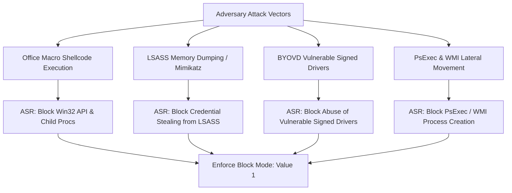

# Windows CIS Benchmark — Attack Surface Reduction (ASR) & Credential Guard

Operating system hardening requires proactively eliminating exploitation primitives before adversary execution begins. **CIS Section 18 & 19 (Administrative Templates)** mandates hardware-backed isolation via **Windows Defender Credential Guard**, complete enablement of **Attack Surface Reduction (ASR)** rules, and host firewall default-deny isolation.

---

## 1. Attack Surface Reduction (ASR) Complete CIS Matrix

Attack Surface Reduction rules intercept common infection techniques before malicious code executes in memory. The CIS Benchmark specifies that enterprise endpoints enforce these rules in **Block mode (`1`)** or **Audit mode (`2`)** during staging.



### The 16 CIS ASR Rules Reference

| ASR Rule GUID | Rule Description | CIS Standard | Primary Technique Mitigated |
| :--- | :--- | :---: | :--- |
| `9e6c4e1f-7d60-472f-ba1a-a39ef669e4b2` | Block credential stealing from LSASS | **Block (1)** | T1003.001 (OS Credential Dumping: LSASS) |
| `d4f940ab-401b-4efc-aadc-ad5f3c50688a` | Block Office apps from creating child processes | **Block (1)** | T1204.002 (Malicious File: Office Macro) |
| `756346d7-0957-498c-a4b1-b76ac47fd73d` | Block Office apps from injecting code into processes | **Block (1)** | T1055 (Process Injection) |
| `92e97fa1-2edf-4476-bdd6-9dd0b4dddc7b` | Block Win32 API calls from Office macros | **Block (1)** | T1059.005 (Visual Basic) |
| `3b5764ba-6377-43a1-8642-03d40e16e224` | Block Office apps from creating executable content | **Block (1)** | T1105 (Ingress Tool Transfer) |
| `be9ba2d9-53ea-4cdc-84e5-9b1eeee46550` | Block executable content from email client/webmail | **Block (1)** | T1566.001 (Spearphishing Attachment) |
| `5beb0a2d-9a0a-4a09-96da-42993b5a6ddb` | Block execution of potentially obfuscated scripts | **Block (1)** | T1027 (Obfuscated Files or Information) |
| `d3e037e1-3eb8-44c8-a917-57927947596d` | Block JS/VBS from launching downloaded executables | **Block (1)** | T1059.005 (VBScript/JScript Droppers) |
| `d1e49aac-8f56-4280-b9ba-993a6d77406c` | Block process creations from PSExec and WMI commands | **Block (1)** | T1047 (WMI), T1021.002 (SMB/PsExec) |
| `b2b3f03d-6a65-4f7b-a9c7-1c7ef74a9ba4` | Block untrusted/unsigned processes that run from USB | **Block (1)** | T1091 (Replication Through Removable Media) |
| `01443614-cd74-433a-b99e-2ecdc07bfc25` | Block executable files unless meeting prevalence criteria | **Block (1)** | T1204 (User Execution of Novel Payloads) |
| `c1db55ab-5378-4508-ba71-56134c7ac45c` | Block use of copied or impersonated system tools | **Block (1)** | T1036.003 (Masquerading) |
| `7674ba52-37eb-4a4f-a9a1-f0f9a1619a2c` | Block Adobe Reader from creating child processes | **Block (1)** | T1204 (PDF Exploitation) |
| `e6db77e5-3e12-4247-81d7-4dd7558116ec` | Block persistence through WMI event subscription | **Block (1)** | T1546.003 (Event Triggered Execution: WMI) |
| `56a863a9-875e-4185-98a7-b882c60b5ce5` | Block abuse of exploited vulnerable signed drivers | **Block (1)** | T1068, T1562.001 (BYOVD Defense Impairment) |
| `33ddedf1-c6e0-47cb-833e-de6133960387` | Block rebooting machine in Safe Mode | **Block (1)** | T1562.009 (Safe Mode EDR Bypass) |

---

## 2. Automated PowerShell ASR Rule Deployment

```powershell
# Set-ExecutionPolicy Bypass -Scope Process
# Execute within an elevated Administrator PowerShell session

Write-Host "[CIS 18.4] Enforcing Full 16-Rule ASR Suite in Block Mode..." -ForegroundColor Cyan

$AsrCatalog = @(
    "9e6c4e1f-7d60-472f-ba1a-a39ef669e4b2", # Block credential stealing from LSASS
    "d4f940ab-401b-4efc-aadc-ad5f3c50688a", # Block Office child processes
    "756346d7-0957-498c-a4b1-b76ac47fd73d", # Block Office code injection
    "92e97fa1-2edf-4476-bdd6-9dd0b4dddc7b", # Block Win32 API from Office macros
    "3b5764ba-6377-43a1-8642-03d40e16e224", # Block Office executable content
    "be9ba2d9-53ea-4cdc-84e5-9b1eeee46550", # Block executable content from email
    "5beb0a2d-9a0a-4a09-96da-42993b5a6ddb", # Block obfuscated scripts
    "d3e037e1-3eb8-44c8-a917-57927947596d", # Block JS/VBS downloaded executables
    "d1e49aac-8f56-4280-b9ba-993a6d77406c", # Block PSExec and WMI commands
    "b2b3f03d-6a65-4f7b-a9c7-1c7ef74a9ba4", # Block untrusted unsigned USB processes
    "01443614-cd74-433a-b99e-2ecdc07bfc25", # Block novel un-prevalent executables
    "c1db55ab-5378-4508-ba71-56134c7ac45c", # Block impersonated system tools
    "7674ba52-37eb-4a4f-a9a1-f0f9a1619a2c", # Block Adobe Reader child processes
    "e6db77e5-3e12-4247-81d7-4dd7558116ec", # Block WMI persistence subscription
    "56a863a9-875e-4185-98a7-b882c60b5ce5", # Block vulnerable signed drivers (BYOVD)
    "33ddedf1-c6e0-47cb-833e-de6133960387"  # Block rebooting into Safe Mode
)

$Actions = [int[]](1..$AsrCatalog.Count | ForEach-Object { 1 }) # 1 = Block

Set-MpPreference -AttackSurfaceReductionRules_Ids $AsrCatalog -AttackSurfaceReductionRules_Actions $Actions

Write-Host "[CIS 18.4] Successfully enforced $($AsrCatalog.Count) ASR rules." -ForegroundColor Green
```

---

## 3. Windows Defender Credential Guard (CIS 18.3.1)

Credential Guard isolates NTLM hashes, Kerberos ticket-granting tickets (TGTs), and credentials inside an isolated Virtual Secure Mode (VSM) container using Hyper-V Virtualization-Based Security (VBS). Even local administrative malware cannot read secrets from the isolated `LSAIso` process.

### Enabling Credential Guard via Registry

```powershell
# 1. Enable Virtualization-Based Security (VBS)
$DeviceGuardPath = "HKLM:\SOFTWARE\Policies\Microsoft\Windows\DeviceGuard"
if (!(Test-Path $DeviceGuardPath)) { New-Item -Path $DeviceGuardPath -Force | Out-Null }
Set-ItemProperty -Path $DeviceGuardPath -Name "EnableVirtualizationBasedSecurity" -Value 1 -Type DWord
Set-ItemProperty -Path $DeviceGuardPath -Name "RequirePlatformSecurityFeatures" -Value 1 -Type DWord # 1 = Secure Boot only, 3 = Secure Boot + DMA

# 2. Enable Credential Guard with UEFI Lock (CIS Level 1)
# 1 = Enabled with UEFI lock (cannot be disabled remotely via registry)
# 2 = Enabled without lock (staging/testing)
Set-ItemProperty -Path $DeviceGuardPath -Name "LsaCfgFlags" -Value 1 -Type DWord

# 3. Enforce LSA Protection RunAsPPL
$LsaPath = "HKLM:\SYSTEM\CurrentControlSet\Control\Lsa"
Set-ItemProperty -Path $LsaPath -Name "RunAsPPL" -Value 1 -Type DWord

Write-Host "[CIS 18.3.1] Credential Guard and LSA RunAsPPL configured (Reboot required)." -ForegroundColor Green
```

---

## 4. Windows Defender Firewall CIS Baseline (CIS Section 9)

The CIS Benchmark mandates that Windows Defender Firewall is enforced across all network profiles with strict default-deny inbound rules and packet drop logging.

```powershell
<#
.SYNOPSIS
    Applies the full CIS Section 9 Windows Defender Firewall baseline.
#>
[CmdletBinding()]
param()

Write-Host "[CIS Section 9] Configuring Windows Defender Firewall Profiles..." -ForegroundColor Cyan

$Profiles = @("Domain", "Private", "Public")

foreach ($Profile in $Profiles) {
    Set-NetFirewallProfile -Profile $Profile `
        -Enabled True `
        -DefaultInboundAction Block `
        -DefaultOutboundAction Allow `
        -AllowInboundRules True `
        -LogBlocked True `
        -LogMaxSizeKilobytes 16384 `
        -LogFileName "%SystemRoot%\System32\LogFiles\Firewall\pfirewall.log"
}

# Public profile extra restriction: Do not allow inbound rule exceptions
Set-NetFirewallProfile -Profile Public -AllowInboundRules False

Write-Host "[CIS Section 9] Firewall baseline enforced across all profiles." -ForegroundColor Green
```

---

## 5. Verification & Telemetry Audit

```powershell
# 1. Audit active ASR rules
$Pref = Get-MpPreference
[PSCustomObject]@{
    ConfiguredASRRules = $Pref.AttackSurfaceReductionRules_Ids.Count
    BlockModeCount     = ($Pref.AttackSurfaceReductionRules_Actions | Where-Object { $_ -eq 1 }).Count
    AuditModeCount     = ($Pref.AttackSurfaceReductionRules_Actions | Where-Object { $_ -eq 2 }).Count
} | Format-List

# 2. Audit Credential Guard operational status
$DG = Get-CimInstance -ClassName Win32_DeviceGuard -Namespace root\Microsoft\Windows\DeviceGuard
[PSCustomObject]@{
    VBS_Status              = switch ($DG.VirtualizationBasedSecurityStatus) { 0 { "Disabled" } 1 { "Enabled" } default { "Unknown" } }
    SecurityServicesRunning = $DG.SecurityServicesRunning
    CredentialGuardRunning  = if ($DG.SecurityServicesRunning -contains 1) { "RUNNING" } else { "NOT RUNNING" }
} | Format-List
```
