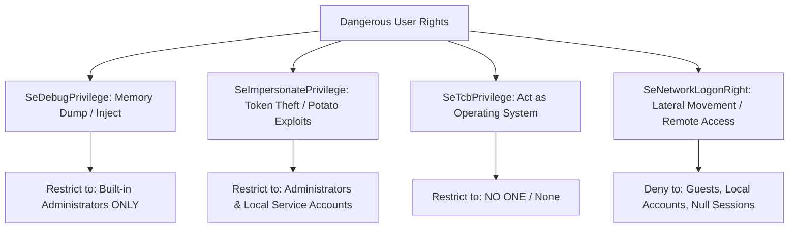

# Windows CIS Benchmark — User Rights Assignment & Account Policies

In Microsoft Windows environments, **Account Policies** (CIS Section 1) and **User Rights Assignment (URA)** (CIS Section 2) form the primary barrier against local privilege escalation, credential theft, and unauthorized lateral movement. Adversaries routinely exploit unconstrained user rights (such as `SeDebugPrivilege` to dump LSASS or `SeImpersonatePrivilege` for "Potato" token elevation) to compromise Domain Controllers and member servers.

---

## 1. CIS Section 1: Account & Kerberos Policy Standards

These settings govern authentication brute-forcing and Kerberos ticket lifecycles across standalone servers, domain members, and Domain Controllers.

| CIS ID | Configuration Setting | CIS Level 1 Standard | Threat Mitigated |
| :--- | :--- | :--- | :--- |
| **1.1.1** | Enforce password history | $\ge 24$ passwords remembered | Password cycling and predictable variations |
| **1.1.2** | Maximum password age | $\le 60$ days (or $\le 365$ with MFA) | Stolen hash longevity |
| **1.1.3** | Minimum password age | $\ge 1$ day | Rapid cycling to bypass password history |
| **1.1.4** | Minimum password length | $\ge 14$ characters | Offline NTLM brute-forcing and rainbow tables |
| **1.1.5** | Password must meet complexity requirements | Enabled (Upper, lower, digits, symbols) | Dictionary attacks |
| **1.2.1** | Account lockout duration | $\ge 15$ minutes (Recommended: 30 mins) | Automated credential stuffing |
| **1.2.2** | Account lockout threshold | $\le 5$ invalid logon attempts | Online password spraying |
| **1.2.3** | Reset account lockout counter after | $\ge 15$ minutes | Slow-rate brute forcing |
| **1.3.1** | Kerberos max tolerance for computer clock sync | $\le 5$ minutes | Kerberos ticket replay attacks |
| **1.3.2** | Kerberos max lifetime for user ticket | $\le 10$ hours | Golden Ticket persistence window |
| **1.3.3** | Kerberos max lifetime for user ticket renewal | $\le 7$ days | Long-term ticket caching |

---

## 2. CIS Section 2.2: User Rights Assignment (URA) Hardening

User Rights Assignment specifies which security principals (users, groups, service accounts) are granted specific low-level OS capabilities.



### Critical High-Risk Privileges

| CIS ID | User Right Constant | Description & Risk | CIS Standard (Level 1 / Level 2) |
| :--- | :--- | :--- | :--- |
| **2.2.14** | `SeDebugPrivilege` | Allows attaching to any process to read/write memory. Exploited by Mimikatz to dump LSASS. | **Administrators** only. Never grant to service accounts or help desk. |
| **2.2.24** | `SeImpersonatePrivilege` | Allows impersonating client security tokens. Exploited by SweetPotato, JuicyPotato, PrintSpoofer. | **Administrators, LOCAL SERVICE, NETWORK SERVICE, SERVICE**. |
| **2.2.3** | `SeTcbPrivilege` | "Act as part of the operating system". Allows generating arbitrary security tokens. | **No One** (Empty / None). |
| **2.2.20** | `SeNetworkLogonRight` | "Access this computer from the network". Allows SMB/RPC lateral movement. | **Administrators, Authenticated Users**. |
| **2.2.21** | `SeDenyNetworkLogonRight` | Explicitly blocks remote network logon. Prevents lateral movement via local accounts. | **Guests, Local Accounts** (Level 2). |
| **2.2.22** | `SeRemoteInteractiveLogonRight` | Allows logging on through Remote Desktop Services (RDP). | **Administrators, Remote Desktop Users**. |
| **2.2.23** | `SeDenyRemoteInteractiveLogonRight`| Explicitly blocks RDP sessions. | **Guests, Local Accounts** (Level 2). |
| **2.2.6** | `SeBackupPrivilege` | Bypass file read permissions to back up files. Exploited to extract `NTDS.dit` or `SAM`. | **Administrators** only. |
| **2.2.37** | `SeRestorePrivilege` | Bypass file write permissions. Can overwrite system binaries. | **Administrators** only. |
| **2.2.40** | `SeTakeOwnershipPrivilege` | Take ownership of files or objects. | **Administrators** only. |

---

## 3. CIS Section 2.3: Security Options Baseline

Security Options enforce critical kernel, network protocol, and authentication behaviors.

| CIS ID | Registry Setting & Target | Recommended Value | Threat Addressed |
| :--- | :--- | :--- | :--- |
| **2.3.11.1** | `HKLM\SYSTEM\CCS\Control\Lsa\LmCompatibilityLevel` | `5` (Send NTLMv2 only, refuse LM & NTLM) | NTLMv1 relay and downgrade attacks |
| **2.3.11.4** | `HKLM\SYSTEM\CCS\Control\Lsa\RestrictAnonymous` | `1` (Do not allow anonymous enumeration of SAM accounts and shares) | Unauthenticated enumeration (Null sessions) |
| **2.3.11.5** | `HKLM\SYSTEM\CCS\Control\Lsa\RestrictAnonymousSAM` | `1` (Do not allow anonymous enumeration of SAM) | BloodHound unauthenticated recon |
| **2.3.11.7** | `HKLM\SYSTEM\CCS\Control\Lsa\NoLMHash` | `1` (Do not store LAN Manager hash value on next password change) | LM hash cracking |
| **2.3.17.1** | `HKLM\SOFTWARE\Microsoft\Windows\CurrentVersion\Policies\System\EnableLUA` | `1` (UAC: Run all administrators in Admin Approval Mode) | Unprompted administrative execution |
| **2.3.17.5** | `HKLM\SOFTWARE\Microsoft\Windows\CurrentVersion\Policies\System\PromptOnSecureDesktop` | `1` (UAC: Switch to the secure desktop when prompting for elevation) | UI spoofing and keylogger interception |
| **2.3.17.6** | `HKLM\SOFTWARE\Microsoft\Windows\CurrentVersion\Policies\System\FilterAdministratorToken` | `1` (UAC: Admin Approval Mode for built-in Administrator account) | Built-in Administrator pass-the-hash |

---

## 4. Secedit INF Automated Deployment Script

The most robust native method to apply and enforce Account Policies and User Rights Assignment without third-party tools is generating and applying a Microsoft `secedit` template.

```powershell
# Set-ExecutionPolicy Bypass -Scope Process
# Execute within an elevated Administrator PowerShell session

$InfPath = Join-Path $env:TEMP "cis_user_rights_baseline.inf"
$SdbPath = Join-Path $env:TEMP "cis_user_rights_baseline.sdb"

Write-Host "[CIS 1 & 2] Generating Secedit Security Template..." -ForegroundColor Cyan

$TemplateContent = @"
[Unicode]
Unicode=yes
[System Access]
MinimumPasswordAge = 1
MaximumPasswordAge = 60
MinimumPasswordLength = 14
PasswordComplexity = 1
PasswordHistorySize = 24
LockoutBadCount = 5
ResetLockoutCount = 15
LockoutDuration = 15
RequireLogonToChangePassword = 0
ClearTextPassword = 0

[Privilege Rights]
; CIS 2.2.14: SeDebugPrivilege -> Administrators only (*S-1-5-32-544)
SeDebugPrivilege = *S-1-5-32-544

; CIS 2.2.24: SeImpersonatePrivilege -> Administrators, LOCAL SERVICE, NETWORK SERVICE, SERVICE
SeImpersonatePrivilege = *S-1-5-32-544,*S-1-5-19,*S-1-5-20,*S-1-5-6

; CIS 2.2.3: SeTcbPrivilege -> None
SeTcbPrivilege = 

; CIS 2.2.6: SeBackupPrivilege -> Administrators only
SeBackupPrivilege = *S-1-5-32-544

; CIS 2.2.37: SeRestorePrivilege -> Administrators only
SeRestorePrivilege = *S-1-5-32-544

; CIS 2.2.40: SeTakeOwnershipPrivilege -> Administrators only
SeTakeOwnershipPrivilege = *S-1-5-32-544

; CIS 2.2.21: SeDenyNetworkLogonRight -> Guests, Local Accounts
SeDenyNetworkLogonRight = *S-1-5-32-546,*S-1-5-113

; CIS 2.2.23: SeDenyRemoteInteractiveLogonRight -> Guests, Local Accounts
SeDenyRemoteInteractiveLogonRight = *S-1-5-32-546,*S-1-5-113

[Version]
signature="`$CHICAGO`$"
Revision=1
"@

Set-Content -Path $InfPath -Value $TemplateContent -Encoding Unicode -Force

Write-Host "[CIS 1 & 2] Applying baseline configuration via secedit..." -ForegroundColor Cyan
secedit.exe /configure /db $SdbPath /cfg $InfPath /areas SECURITYPOLICY USER_RIGHTS /quiet

# Cleanup temporary INF and SDB files
Remove-Item -Path $InfPath, $SdbPath -Force -ErrorAction SilentlyContinue

Write-Host "[CIS 1 & 2] Account Policies and User Rights Assignment applied successfully." -ForegroundColor Green
```

---

## 5. PowerShell Compliance Verification

Audit local user rights and account policies against the CIS baseline:

```powershell
function Test-CisUserRightsCompliance {
    [CmdletBinding()]
    param()

    Write-Host "Auditing CIS Section 1 & 2 Baseline Compliance..." -ForegroundColor Yellow

    # 1. Export current active security settings
    $TempExport = Join-Path $env:TEMP "current_sec_audit.inf"
    secedit.exe /export /cfg $TempExport /areas SECURITYPOLICY USER_RIGHTS | Out-Null
    $content = Get-Content $TempExport -Raw
    Remove-Item $TempExport -Force -ErrorAction SilentlyContinue

    # Parse Account Policies
    $PassLen = if ($content -match 'MinimumPasswordLength\s*=\s*(\d+)') { [int]$Matches[1] } else { 0 }
    $Lockout = if ($content -match 'LockoutBadCount\s*=\s*(\d+)') { [int]$Matches[1] } else { 0 }
    
    # Check SeDebugPrivilege
    $DebugPriv = if ($content -match 'SeDebugPrivilege\s*=\s*([^\r\n]+)') { $Matches[1].Trim() } else { "None" }

    [PSCustomObject]@{
        "CIS 1.1.4 Min Password Length (>=14)"   = if ($PassLen -ge 14) { "PASS ($PassLen)" } else { "FAIL ($PassLen)" }
        "CIS 1.2.2 Lockout Threshold (<=5)"      = if ($Lockout -gt 0 -and $Lockout -le 5) { "PASS ($Lockout)" } else { "FAIL ($Lockout)" }
        "CIS 2.2.14 SeDebugPrivilege (Admin Only)"= if ($DebugPriv -eq "*S-1-5-32-544") { "PASS" } else { "FAIL ($DebugPriv)" }
    } | Format-List
}

Test-CisUserRightsCompliance
```
