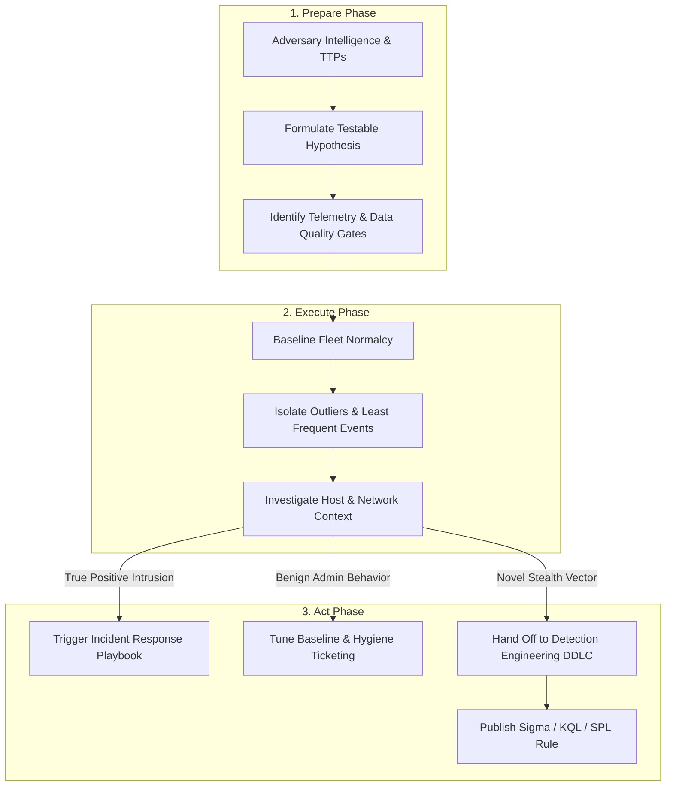
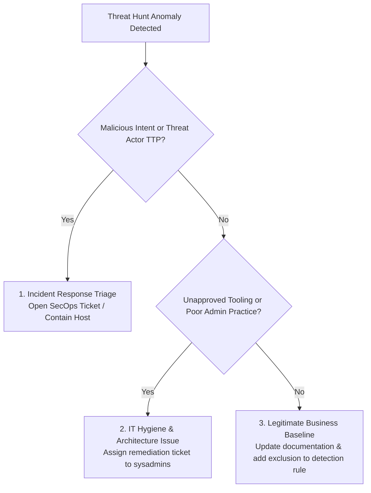

# Threat Hunting — Hypothesis-Driven Methodology & Hunt Lifecycle Framework

Threat hunting is a proactive, analyst-driven iterative query process designed to detect malicious presence, lateral movement, and persistence mechanisms that have evaded automated detection alerts. This framework standardizes the hunt lifecycle from threat intelligence ingestion through hypothesis formulation, data validation, execution, and detection engineering transition.

---

## 1. Threat Hunting Frameworks: PEAK & TaHiTI

Modern threat hunting integrates the **PEAK** (Prepare, Execute, Act with Knowledge) and **TaHiTI** (Targeted Hunting Integrating Threat Intelligence) methodologies into a closed-loop engineering cycle.



### Hunting Maturity Model (HMM)

| Level | Name | Primary Data Source | Hunting Approach | Automation & Output |
| :--- | :--- | :--- | :--- | :--- |
| **HMM 0** | Initial | Reactive alert feeds only | Ad-hoc, response-driven | None (reactive SOC alerts only) |
| **HMM 1** | Minimal | Centralized event logs | Routine search queries | Ad-hoc spreadsheet tracking |
| **HMM 2** | Procedural | High-fidelity EDR & Sysmon telemetry | Pre-defined hunt playbooks | Structured queries with documented runbooks |
| **HMM 3** | Innovative | Fleet telemetry, network flow, cloud audit | Custom data modeling & statistical outliers | Machine learning, LFO frequency baselines |
| **HMM 4** | Leading | Real-time graph analytics, enterprise telemetry | Continuous hypothesis-driven campaigns | Automated hunting jobs feeding the DDLC pipeline |

---

## 2. Hypothesis Formulation Standard

Every hunt campaign begins with an actionable, falsifiable hypothesis. Avoid open-ended queries without clear scope or validation criteria.

### The Hypothesis Equation

$$\text{Hypothesis} = [\text{Actor / Tool / Technique}] + [\text{Environmental Context}] + [\text{Expected Telemetry Artifact}]$$

* **Null Hypothesis ($H_0$):** The observed fleet telemetry conforms to documented administrative baselines, standard software update processes, or approved administrative automation.
* **Alternative Hypothesis ($H_1$):** Adversaries are leveraging unmonitored Living-off-the-Land Binaries (LOLBins) or hijacked service credentials to execute remote commands without triggering high-severity alerts.

### Example Hypothesis Matrix

| Hunt ID | MITRE Technique | Formulated Hypothesis ($H_1$) | Telemetry Prerequisites |
| :--- | :--- | :--- | :--- |
| **TH-001** | T1059.001 (PowerShell) | Adversaries execute base64-encoded download cradles from non-interactive system service accounts (`LOCAL SYSTEM`, `NETWORK SERVICE`). | Process creation (Sysmon Event ID 1 / MDE `DeviceProcessEvents`), command line auditing. |
| **TH-002** | T1053.005 (Scheduled Task) | Adversaries establish persistence via scheduled tasks executing binaries outside `C:\Windows\System32\` and `Program Files`. | Security Event ID 4698, TaskScheduler operational logs (Event ID 106), Sysmon Event ID 1. |
| **TH-003** | T1095 (Non-App Protocol) | Implants maintain egress C2 communication via direct IP outbound connections exhibiting consistent sleep-jitter timing profiles. | Firewall egress flow logs, Sysmon Event ID 3, MDE `DeviceNetworkEvents`. |

---

## 3. Pre-Flight Data Quality Gates

Before initiating large-scale fleet queries across SIEM or data lake repositories, execute quality checks to prevent false negatives from missing telemetry.

### Data Completeness Checklist

1. **Host Ingestion Health:** Ensure $\ge 98\%$ of fleet agents reported events within the last 24 hours.
2. **Command Line Logging:** Confirm process creation events include full un-truncated command line arguments (Windows Event ID 4688 with `CommandLine` enabled via GPO, or Sysmon Event ID 1).
3. **Retention Horizon:** Confirm log retention spans at least 30 to 90 days for behavioral baselining.
4. **Time Sync (NTP):** Ensure endpoint clock skew across endpoints and domain controllers is $< 1000\text{ ms}$.

```powershell
# Verify Endpoint Process Auditing Baseline via PowerShell
$AuditPolicy = auditpol.exe /get /subcategory:"Process Creation" /r | ConvertFrom-Csv
$AuditPolicy | Where-Object { $_.'Subcategory' -eq "Process Creation" } | Select-Object Subcategory, "Inclusion Setting"

# Confirm CommandLine parameter auditing in Event 4688
$RegPath = "HKLM:\Software\Microsoft\Windows\CurrentVersion\Policies\System\Audit"
if (Test-Path $RegPath) {
    Get-ItemProperty -Path $RegPath -Name "ProcessCreationIncludeCmdLine_Enabled" -ErrorAction SilentlyContinue
}
```

```bash
# Verify Linux auditd operational status and rule ingestion
auditctl -s
auditctl -l | grep -E "execve|process"
```

---

## 4. The 4-Stage Execution Loop

```
[ Stage 1: Broad Scoping ] -> Filter on target binary or event archetype
           │
[ Stage 2: Baseling / LFO ] -> Group by parent/child/user and sort ascending by count
           │
[ Stage 3: Entity Pivot ]   -> Correlate rare instances against host network/file timeline
           │
[ Stage 4: Triage Decision] -> Categorize: True Positive, Policy Hygiene, or Benign Exception
```

### Stage 1: Scoping Filter
Select the target activity domain (e.g., all executions of script interpreters or remote administration tools) across a 14-day to 30-day window.

### Stage 2: Least Frequency of Occurrence (LFO)
Aggregate by hash, parent process, user, and command-line signature. Sort in **ascending order** to isolate commands executed on only 1–2 endpoints across an organization of thousands.

### Stage 3: Entity Context Pivot
When an outlier is detected, pivot into the endpoint timeline 15 minutes before and 15 minutes after the execution timestamp. Inspect:
* Child processes spawned.
* Network connections initiated immediately post-execution.
* File write artifacts created in `%TEMP%`, `C:\Users\Public\`, or `/tmp/`.

### Stage 4: Finding Triage
Assign every identified anomaly into one of three distinct categories:



---

## 5. Converting Hunts into Detection Engineering (DDLC Hand-off)

The ultimate success metric of a threat hunting campaign is **eradicating the need to perform that same hunt manually in the future**.

```markdown
### Hunt-to-Detection Transition Template

* **Hunt Identification:** TH-001 (Non-interactive Encoded PowerShell Execution)
* **Analyzed Window:** 30 Days (15,000 hosts)
* **Initial Anomaly Count:** 42 outliers
* **Validated True Positives:** 0 intrusions, 3 unapproved admin scripts, 39 benign updater jobs
* **Target Detection Hypothesis:** Alert when PowerShell runs with Base64 encoding parameters (`-enc`, `-encodedcommand`) spawned by non-interactive service parents (`services.exe`, `spoolsv.exe`, `w3wp.exe`).
* **Deployment Output:**
  - Standardized Sigma rule created: `rules/windows/process_creation/proc_creation_win_powershell_service_parent_encoded.yml`
  - KQL rule translated for Microsoft Defender XDR.
  - SPL rule translated for Splunk Enterprise Security.
```

---

## 6. Threat Hunt Retrospective & Metrics

Measure hunt program performance with standardized quarterly operational metrics:

$$\text{Hunt Yield Rate} = \frac{\text{Intrusions} + \text{Policy Hygiene Findings}}{\text{Total Completed Hunts}} \times 100$$

$$\text{Detection Conversion Ratio} = \frac{\text{New Detection Rules Deployed from Hunts}}{\text{Total Hunts Completed}} \times 100$$

* **Mean Time to Scrutiny (MTTS):** Average hours elapsed from hypothesis approval to query execution.
* **Coverage Delta:** Percentage increase in MITRE ATT&CK technique visibility validated by threat hunt scripts.
