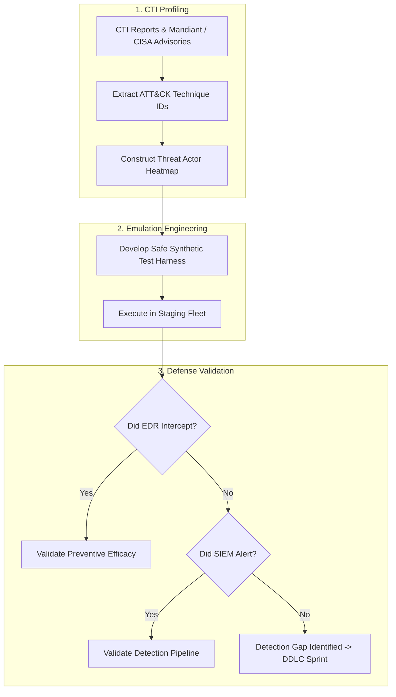

# Cyber Threat Intelligence — Adversary Emulation & ATT&CK Profiling

A **Threat-Informed Defense** translates high-level adversary intelligence into repeatable, controlled adversary emulation plans. By executing synthetic adversary techniques across staging and production fleets, security teams validate whether existing SIEM detection rules and EDR preventive controls successfully intercept malicious tradecraft before a real breach occurs.

---

## 1. Adversary Emulation Methodology

Adversary emulation is distinct from unconstrained penetration testing: it strictly replicates the documented Tactics, Techniques, and Procedures (TTPs) of specific threat groups within a defined kill-chain sequence.



---

## 2. Threat Group Archetype Comparison

| Threat Archetype | Representative Groups | Primary Objectives | Typical Tooling & Tradecraft | Key ATT&CK Techniques |
| :--- | :--- | :--- | :--- | :--- |
| **Financially Motivated Ransomware** | BlackCat (ALPHV), LockBit 3.0, Akira | Data extortion, fleet encryption, backup destruction | Cobalt Strike, PsExec, Impacket, MegaSync, `vssadmin` deletion | T1486 (Data Encrypted for Impact), T1490 (Inhibit System Recovery), T1047 (WMI) |
| **State-Sponsored Espionage** | Midnight Blizzard (APT29), Volt Typhoon | Long-term intelligence harvesting, living off the land | Compromised OAuth apps, residential proxies, LOLBins, zero-day appliances | T1098.003 (Consent Grants), T1078 (Valid Accounts), T1059.004 (Unix Shell) |
| **Initial Access Brokers (IABs)** | Storm-0249, TA577 | Perimeter infiltration, corporate credential resale | Phishing with ISO/VHD payloads, infostealers (RedLine, Lumma), web shells | T1204 (User Execution), T1566 (Phishing), T1555 (Credentials from Password Stores) |

---

## 3. Emulation Plan Construction: Ransomware Pre-Ransom Behavior

Before deploying ransomware encryption payloads, adversaries systematically execute staging actions: disabling recovery points, terminating security services, and performing SMB network enumeration.

### Phase 1: Recovery Invalidation (T1490) Emulation Script

```powershell
<#
.SYNOPSIS
    Synthetic adversary emulation for T1490 (Inhibit System Recovery).
    Executes non-destructive queries and mock invocations to validate telemetry.
#>
[CmdletBinding()]
param(
    [switch]$AuditOnly = $true
)

Write-Host "[EMULATION] Starting T1490 Telemetry Validation Harness..." -ForegroundColor Yellow

# Step 1: Simulate vssadmin shadow copy query (Benign interrogation)
Write-Host "-> Executing vssadmin list shadows..." -ForegroundColor Cyan
& vssadmin.exe list shadows

# Step 2: Execute mock bcdedit interrogation
Write-Host "-> Querying bcdedit boot configuration..." -ForegroundColor Cyan
& bcdedit.exe /enum "{current}"

# Step 3: Emit canary event to Event Log to measure SIEM detection latency
$CanaryMessage = "EMULATION_TEST: T1490 simulation executed by user $env:USERNAME on host $env:COMPUTERNAME"
Write-EventLog -LogName Application -Source "Application Error" -EventId 9999 -EntryType Warning -Message $CanaryMessage -ErrorAction SilentlyContinue

Write-Host "[EMULATION] Complete. Inspect SIEM detection pipeline for alert generation." -ForegroundColor Green
```

### Phase 2: Linux Anti-Forensics & Audit Tampering (T1562.001) Emulation

```bash
#!/usr/bin/env bash
# Synthetic adversary emulation for T1562.001 (Impair Defenses - Linux Logging)
echo "[EMULATION] Testing detection of shell history suppression..."

# Test 1: Spawning subshell with HISTFILE unset
bash -c 'unset HISTFILE; echo "CANARY_ADVERSARY_COMMAND" > /dev/null'

# Test 2: Testing auditctl status query (reconnaissance before tampering)
if command -v auditctl >/dev/null 2>&1; then
    echo "[EMULATION] Interrogating audit rules..."
    auditctl -s
fi

echo "[EMULATION] Test complete. Verify Auditd and SIEM telemetry capture."
```

---

## 4. Detection Validation Queries

### Microsoft Defender XDR (KQL): Ransomware Staging TTP Heatmap

```kql
// Detect emulation or true adversary behavior matching pre-ransom staging
DeviceProcessEvents
| where TimeGenerated >= ago(2h)
| where (
    // T1490: Shadow copy deletion
    (FileName =~ "vssadmin.exe" and ProcessCommandLine has_any ("delete shadows", "resize shadowstorage"))
    or (FileName =~ "wmic.exe" and ProcessCommandLine has "shadowcopy delete")
    or (FileName =~ "bcdedit.exe" and ProcessCommandLine has_any ("recoveryenabled no", "bootstatuspolicy ignoreallfailures"))
    // T1489: Service termination
    or (FileName in~ ("net.exe", "sc.exe") and ProcessCommandLine has_any ("stop", "pause") and ProcessCommandLine has_any ("vss", "sql", "sophos", "windefend"))
)
| project TimeGenerated, DeviceName, InitiatingProcessFileName, FileName, ProcessCommandLine, AccountName
| sort by TimeGenerated desc
```

### Splunk (SPL): Multiple Kill-Chain Stage Correlation

```spl
index=endpoint sourcetype="XmlWinEventLog:Microsoft-Windows-Sysmon/Operational" EventCode=1
    (CommandLine="*vssadmin*delete*" OR CommandLine="*bcdedit*ignoreallfailures*" OR CommandLine="*wbadmin*delete*")
| stats earliest(_time) as FirstSeen, latest(_time) as LastSeen, count, values(CommandLine) as StagingCommands by Computer, User
| where count >= 1
```

---

## 5. Post-Emulation Remediation & Metric Capture

Following each emulation cycle, compute the **Detection Gap Ratio**:

$$\text{Detection Gap Ratio} = \frac{\text{Emulated TTPs with No Alert}}{\text{Total Emulated TTPs}} \times 100$$

* Target standard: **$< 10\%$ gap ratio** across high-priority ransomware techniques.
* Any un-alerted technique automatically generates a prioritized sprint ticket in the Detection Development Lifecycle (DDLC).
