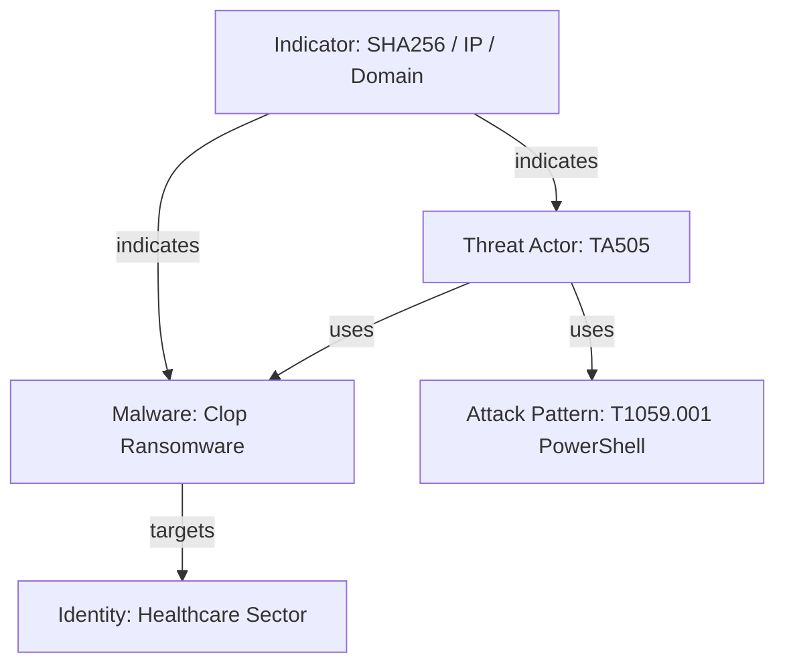

# Cyber Threat Intelligence — STIX 2.1 & TAXII Feed Ingestion Pipeline

Structured Threat Information Expression (**STIX 2.1**) and Trusted Automated eXchange of Intelligence Information (**TAXII 2.1**) represent the global OASIS standards for formatting and transmitting machine-readable cyber threat intelligence (CTI). This workflow details end-to-end feed harvesting, object parsing, indicator extraction, and automated injection into SIEM and EDR detection ecosystems.

---

## 1. STIX 2.1 Architecture & Object Taxonomy

STIX 2.1 represents adversary infrastructure and activity as a connected graph of JSON objects:



### Core STIX Domain Objects (SDOs)

| SDO Type | Primary Purpose | Key Schema Fields |
| :--- | :--- | :--- |
| **`indicator`** | Observable pattern detecting malicious activity | `pattern`, `pattern_type` (stix), `valid_from`, `valid_until` |
| **`malware`** | Software engineered to execute malicious operations | `name`, `is_family`, `malware_types`, `capabilities` |
| **`threat-actor`** | Individual, group, or organization conducting malicious activity | `name`, `aliases`, `roles`, `goals`, `sophistication` |
| **`attack-pattern`** | Adversary TTP mapped directly to MITRE ATT&CK | `name`, `external_references` (technique ID: `T1059.001`) |
| **`relationship`** | Directed edge linking two SDOs (SRO) | `source_ref`, `target_ref`, `relationship_type` |

---

## 2. TAXII 2.1 Protocol Specifications

TAXII 2.1 operates over HTTPS with strict REST semantics and JSON payloads (`application/taxii+json;version=2.1`).

* **Server Discovery:** `GET https://taxii.example.org/taxii2/` $\rightarrow$ returns available API Roots.
* **API Root Collections:** `GET https://taxii.example.org/api1/collections/` $\rightarrow$ returns collection IDs.
* **Object Retrieval:** `GET https://taxii.example.org/api1/collections/{id}/objects/?added_after=2026-10-01T00:00:00Z` $\rightarrow$ delivers STIX 2.1 bundle.

---

## 3. Standard Library Python Feed Ingestion Engine

This hermetic Python script polls a STIX 2.1 JSON bundle, extracts indicators (IPv4, domains, SHA256 hashes), normalizes fields, and filters expired artifacts without requiring external dependencies:

```python
#!/usr/bin/env python3
"""
tools/ingest_stix_bundle.py — Zero-dependency STIX 2.1 indicator extractor.
"""
import json
import re
import sys
from datetime import datetime, timezone
from pathlib import Path

def parse_stix_pattern(pattern: str) -> list:
    """Parse STIX indicator comparison expressions into structured tuples."""
    results = []
    # Match [ipv4-addr:value = 'x.x.x.x']
    ip_matches = re.findall(r"\[ipv4-addr:value\s*=\s*'([^']+)'\]", pattern)
    for ip in ip_matches:
        results.append(("ipv4", ip))
        
    # Match [domain-name:value = 'bad.com']
    domain_matches = re.findall(r"\[domain-name:value\s*=\s*'([^']+)'\]", pattern)
    for domain in domain_matches:
        results.append(("domain", domain))
        
    # Match [file:hashes.'SHA-256' = 'hash']
    hash_matches = re.findall(r"\[file:hashes\.'SHA-256'\s*=\s*'([^']+)'\]", pattern)
    for sha in hash_matches:
        results.append(("sha256", sha))
    return results

def process_bundle(bundle_data: dict) -> list:
    now = datetime.now(timezone.utc)
    extracted = []
    
    for obj in bundle_data.get("objects", []):
        if obj.get("type") != "indicator":
            continue
            
        # Verify indicator is not expired
        valid_until_str = obj.get("valid_until")
        if valid_until_str:
            try:
                valid_until = datetime.fromisoformat(valid_until_str.replace("Z", "+00:00"))
                if valid_until < now:
                    continue  # Skip expired indicator
            except ValueError:
                pass
                
        name = obj.get("name", "Unknown Indicator")
        confidence = obj.get("confidence", 50)
        pattern = obj.get("pattern", "")
        
        for ioc_type, ioc_val in parse_stix_pattern(pattern):
            extracted.append({
                "type": ioc_type,
                "value": ioc_val,
                "confidence": confidence,
                "name": name,
                "source_id": obj.get("id")
            })
    return extracted

if __name__ == "__main__":
    if len(sys.argv) < 2:
        print("Usage: python ingest_stix_bundle.py <stix_bundle.json>")
        sys.exit(1)
        
    bundle_path = Path(sys.argv[1])
    if not bundle_path.exists():
        print(f"Error: {bundle_path} not found.")
        sys.exit(1)
        
    data = json.loads(bundle_path.read_text(encoding="utf-8"))
    iocs = process_bundle(data)
    print(f"Extracted {len(iocs)} valid unexpired indicators.")
    for ioc in iocs[:5]:
        print(f"  [{ioc['type'].upper()}] {ioc['value']} (Confidence: {ioc['confidence']}%) - {ioc['name']}")
```

---

## 4. SIEM & EDR Threat Intelligence Ingestion

### Microsoft Sentinel / Defender XDR: ThreatIntelligenceIndicator Table

When STIX feeds are ingested via Microsoft Sentinel Data Connectors (Threat Intelligence Platforms or TAXII connector), observables populate the `ThreatIntelligenceIndicator` table.

```kql
// Correlate outbound network connections against active CTI IP indicators
let ActiveIndicators = ThreatIntelligenceIndicator
| where Active == true and ExpirationDateTime > now()
| where isnotempty(NetworkIP)
| summarize LatestConfidence = max(ConfidenceScore) by NetworkIP = tostring(NetworkIP), Description;
DeviceNetworkEvents
| where TimeGenerated >= ago(24h)
| where ActionType == "ConnectionSuccess"
| project TimeGenerated, DeviceName, InitiatingProcessFileName, RemoteIP
| join kind=inner (ActiveIndicators) on $left.RemoteIP == $right.NetworkIP
| project TimeGenerated, DeviceName, InitiatingProcessFileName, RemoteIP, LatestConfidence, Description
| sort by LatestConfidence desc
```

### Splunk: Threat Intelligence Framework (KV Store Lookups)

```spl
| inputlookup threat_intel_ip_lookup
| search active=1 confidence>=70
| rename ip as remote_ip
| join remote_ip [
    search index=network sourcetype="pan:traffic" action=allowed
    | fields _time, src_ip, remote_ip, dest_port
]
| table _time, src_ip, remote_ip, dest_port, threat_actor, confidence
```

---

## 5. Indicator Revocation & Lifecycle Management

To prevent false positive flooding and query degradation:

1. **Enforce TTL Windows:** Default maximum indicator lifetimes:
   * Dynamic IP addresses: **14 days**.
   * Domain names: **30 days**.
   * File hashes (immutable SHA256): **180 days**.
2. **Handle STIX Revocations:** If a STIX object receives `revoked: true`, immediately execute an automated purge from SIEM lookup tables.
3. **Score-Based Gating:** Block traffic at firewalls only for indicators with $\ge 80\%$ confidence. Indicators between $50\%$ and $79\%$ should generate hunting alerts rather than inline drops.
